<!-- Preamble

make quarto FN=size_structured_model_snowcrab.md DOCTYPE=html  PARAMS="-P YR:2025 -P todo:[nil]" --directory=~/projects/model_size/docs
 
# all modifiable params 
make quarto FN=size_structured_model_snowcrab.md DOCTYPE=html  PARAMS="-P project_directory:~/projects/model_size -P work_directory:~/projects/model_size/ignore -P YR:2025 -P todo:[fishery_results,fishery_model,ecosystem,redo_data]" --directory=~/projects/model_size/docs
 

# https://github.com/citation-style-language/styles  # to get more csl's

To include a common file:


-->

<!-- to include shared files

  

  

-->


## Purpose

To develop a size-structured model of snow crab (*Chionoectes opilio*) using a matrix model (aka, a *Generalized Leslie* matrix model (GLMM), or also known as a Stage-Based Transition Matrix model, SBTMM), except that instead of age as the classifying units, we use size and stage (sex and maturity). 

## Approach

At a minimum, the following information is required for a size-structured matrix model:

(1) *Representative size-frequency distributions across space and time*

  Measuring body size is a basic element of any monitoring system. However, no matter how randomized a sampling design may be, there is an inherent bias associated with most forms of sampling. This bias is due to the sampling device (mesh size, hook size) used for capture *and* sampling design limitations. No matter how well constructed, sampling design cannot be sufficiently well-informed to ensure ensure completely random sampling, due to time and space-varying environmental and behavioural variability than cannot be know *apriori*. The latter can, however, be partially addressed through a model-based, *aposteriori* methods that are collectively known as *Post-Stratification* bias correction. From such analyses, a representative distribution of size by stage can then be used to inform/identify/classify size modes and associated numerical abundance in each mode.

(2) *Size-based understanding of life history*

  Parameterization of growth, fecundity, survivorship. Life history processes such as growth and fecundity are reasonably quickly determined and improved with continued monitoring. Survivorship (the complement of natural mortality) is, however, a challenge to estimate unless a population is at steady-state and so requires experimentation or simplifying assumptions to be made.
   
(3) *Size-based understanding of fishery removals*

  A sampling or monitoring program needs to be in place to estimate the usually size-selective removals or mortalities from the population.


Here we will attempt to address each of these components and then synthesize them towards a matrix-based representation of size-stage-based dynamics.


## 1. Size-frequency distributions across space and time

A size-frequency distribution of some system of interest $S$, is usually obtained from the observation of body size measurements (e.g., weight, length, and in the case of snow crab, often, carapace width) at various locations and times (seasonal, inter-annual) inside the area of interest. To represent the overall size distribution, these observations must be summarized in some manner. If the samples are derived from a truly random sample of $S$, then the usual approach of simply aggregating counts by size-intervals is sufficient to obtain an estimate of the size frequency distribution. This is because these samples can be considered *representative* of $S$ and each individual observation contributes an *equal* amount of information in representing the system; that is, they can be considered *exchangeable* (aka, "independently and identically distributed" or *iid*), under the context of the sampling structure/design. To re-iterate, each individual observation or measurement carries the same *weight* of information.


When organisms are distributed in a nonrandom manner across space and time in a size-dependent manner, this "weight" is not always equal. Naive sampling of such a nonrandom distribution cannot be representative, especially when the number of samples are much lower than the total population, $n_s << n_S$. Stratified random sampling is used to try to reduce such biases, however, this only work if the factors that affect the non-random distribution is known *apriori* and remains invariant in time or associated with sampling intensity (e.g., swept area in a trawl, number of traps or hooks used and usually determined before sampling). These are known as design weights, that is, information known *apriori* to be influential to estimation.

However, factors can be influential and not determinable before sampling. When, environmentally extreme conditions are encountered due to underlying spatio-temporal variability of these influential factors, that are not representative of the overall system, bias can occur. To make them comparable across such factors means that we need to address *habitat* variability issues directly. By *habitat*, we mean that organisms have metabolic, physiological and behavioural preferences and limits in the environmental and ecosystem conditions they can or cannot inhabit, in the sense of Elton (19XX). Variations in habitat result in differential growth, reproduction, movement and ontogenetic behaviour in general, rendering a naive random sampling assumption potentially problematic. 

To be-labour the point, animals can, due to metabolic constraints and behavioural traits (aggregation/clustering/schooling), demonstrate ontogenetic (size- and age-specific) shifts in habitat preferences which ultimately results in observed/sampled data with bias due to certain environments being more or less observable due to sampling not accounting for this underlying non-random and time-varying structure. Further, imperfect sampling methods such as:

  - nets or sampling gear not able to access rocky, heterogenous, or deep environments
  - not able to access areas of high currents or rapid changes in bathymetry (cliffs and rocky protuberances)
  - sampling of one vertical stratum (size of sampling gear) and missing mobile organisms that can escape by swimming over or around the nets or others that can burrow into sediments or shelf beside rocky outcrops below the nets.
  - sampling speed to capture rapidly moving organisms (escapement)
  - sampling mesh too large to capture small organisms (escapement).

Though all these factors can of course cause additional biases, they are usually also ignored giving rise to the common practice of *Let's-hope-this-is-random* (LHTIR) sampling. When little is known of a system at the start of a monitoring program, LHTIR sampling boils down to, "Depth-is-all-we-really-need-to-know" stratification, as depth is usually the only reasonably well-known *apriori* factor. Once established, this stratification seldom changes as any additional strata often becomes exhorbitantly more costly, in terms of needing to justify alterations from LHTIR sampling to incrementally better, re-ananlysis, new survey locations, more data requirements and potential loss of face/trust from data end-users/clients/funders that invested in the initial approach.

As such, when one computes size frequency distributions, almost always, each observation is treated as though they were derived from an IID sample (that is, each individual is fully exchangeable). Indeed, the LHTIR sampling approach is the *defacto* standard. But, what if each observation of an organism is *not exchangeable*? What does this mean, when  observed individual is not of equal importance in describing the attribute in system $S$? If observations occur with more frequency in an area that is not representative of $S$, then it’s relative influence would be inflated causing potential bias in describing $S$, and vice versa. For example, the flooding of an area with warm waters due to larger eddies entering a large oceanic system for a year or more due to elevated and course grained climate variability and change can alter the location and extent of viable habitat and spatial-temporal distributions of animals and therefore render LHTIR samples to be nonrandom due to this previously unaccounted and unaccountable factor in the initial sampling design. In other words, treating observations as random samples would be incorrect when they are not independent samples, across space, time, size (if there are ontogenetic or size-related changes in habitat preferences) and any covariates (e.g. bottom temperatures).

It is also nearly impossible, *apriori*, to correctly design or account for these dynamic, context and size/age-dependent behavioural preferences, especially in a fluid, multidimensional (space, time, species, multiply interacting environmental covariates) environment such as the ocean where the relevant bio-physical-chemical processes do not respect the boundaries of $S$. When, as is often the case, the controlling factors are associated with environmental variability that itself changes unpredictably at various hierarchical levels by its nature across both time and space, it is indeed a challenge to correctly define these strata and obtain an unbiased design. 

Quite often (always?), abundance indices in many fisheries/applied setting use a *fixed factorial* "year-effect" as the index of choice. What does this really mean? A marginal year-effect represents the variations of the trait *independent* of any covariate effects, if any. That is, when all other covariates are held constant at the overall mean of the other effects, usually some reference value for fixed effects and zero-value for random effects. Unfortunately, simply taking the abundance as that which would have been observed at some arbitrary reference level of covariates does not equate to an actual estimate of abundance, nor even relative abundance as it is often suggested; rather, it is a density estimate for those (arbitrary) combinations of covariate conditions; the latter only becomes an abundance estimate if the areal expansion at appropriate (observed) covariate levels is known. By assuming that the domain $S$ is represented by a "year-effect", independent of other effects is valid as an estimate of abundance, to a constant of proportionality, only if sampling is truly IID within $S$. 

Unfortunately, the above is not the case except in environmentally static conditions. In reality, environmentally structured areas, these spatial and temporal bounds of the domain are variable and so requires more covariate information to provide a less biased assessment of the system $S$. The use of additional covariates in a model-based mechanism to reduce this bias is known in epidemiological and social science studies as *Post-stratification* (PS; see [Stan documentation](https://mc-stan.org/docs/stan-users-guide/poststratification.html) and [Wikipedia](https://en.wikipedia.org/wiki/Multilevel_regression_with_poststratification) for further information and history). That is, instead of adjusting the sampling design as new information arises, a model-based (*post-hoc*  or *post-stratified*) approach is used to adjust for unforseen and unforseeable changes in groups/strata structure such that over- or under-represented samples are adjusted. 

Further, in the context of individual level information (e.g., body size), one can go further and estimate the relative importance of each observation in representing the overall post-stratified assessment of the system $S$ with the purpose of reducing these biases, as much as the data available permits. 

<!--
add to discussion:

This PS approach is operationally viable in many long-standing survey/monitoring settings. In operational testing with snow crab surveys in the Maritimes of Canada, it adds a few 10's of hours of computation and with reasonably informative predictive success (Pearson correlation > 0.8). The latter can be improved with more complex and fine-tuned modelling and so can be extended to Large-Language Machine Learning approaches.


add to conclusions: 

adaptive .. which encourages more data collection of relevant information and incorporation/assimilation into statistical modelling and estimation. 

--> 

In other words, in this latter approach, we first estimate a Post-Stratified weight ($\omega_i$) associated with each individual observation ($i$) from an binomial Bernoulli process model. This $\omega_i$, can then be used to determine relative numbers of each size-stage_location-time group by aggregation *aposteriori*, with less bias. The $\omega_i$ are determined *aposteriori* and is distinct from the more commonly encountered *survey design-based sampling weight* which is determined *apriori* from stratum considerations (i.e., often known as statistical offsets, $O_i$). The latter are usually assumed to be known without error. In some well studied areas, if information is available, size selective gear effects and semi-static environmental effects can also be incorporated into the design weights. However, in common practice, most researchers ignore these sampling effects with the often encountered obfuscation: "the data are derived from a *standard* sample", and variability and bias associated with such factors are abstracted away in some random effect term via *LHTIR*. 

Here as we explore the use of an *aposterori* model-based post-stratification approach to derive a more precise and accurate estimate of size-structure, we need to estimate the parameters of an individual level probability model of presence or absence as a binomial Bernoulli process. In our case, this model accounts for space, time, size, sex, maturity, and any other covariates that may be informative and influential in determining an organism's presence or absence (depth, substrate composition, bottom temperatures, species assemblages). Each covariate effect may be discretized, smooth, nonlinear functions or random effects depending upon available computational resources and biological reasonable grounds for a functional form. A Generalized Linear binomial, "multilevel" regression model is specified as:

$$
Y \sim \text{Binomial}(\eta,\theta) \\
{} \\
\text{ln}(\theta/(1-\theta)) = \boldsymbol{X}^{T}\boldsymbol{\beta}+\boldsymbol{\epsilon},
$$

where $Y$ is the vector of observations, taking values of 0 (absent, success) or 1 (present, failure), $\eta$ is the number of trials and $\theta$ is the associated (latent) probability of success, $\boldsymbol{X}^{T}$ is the matrix of covariates with associated parameters $\boldsymbol{\beta}$, and $\epsilon$ is the residual random error. This latter quantity can be expanded to included structured and unstructured random effects. 

The natural logarithm of the ratio of the probabilities, $\text{ln}(\theta/(1-\theta))$ is also commonly referred to as $logit(\theta)$:

$$
\text{ln}(\theta/(1-\theta)) = \boldsymbol{X}^{T}\boldsymbol{\beta} + O_i + \boldsymbol{\epsilon}.
$$
  
The posterior prediction of the probability $\theta_i$ associated with each sampled observation $i$ describes the likely number of successes for a given number of trials. Being a Bernoulli process, the number of trials is $\eta=1$. As mentioned above, associated with each such trial is the swept-area of the sampling gear, any subsampling and quite often vessel/gear correction factors (though the latter vessel/gear correction does not apply to our case) and accounted in the offset term, $O_i$, for each observation. Thus, $O_i$, can be seen as the effective sampling effort (in our case in units of surface area, $m^2$) that standardizes observations to a common basis (number / $m^2$). The number of successes predicted, $N_i$, for a single binomial trial and a given effective sampling effort is:

$$
N_i = \theta_i \cdot \eta \cdot O_i \\
$$

Similarly, the posterior prediction of the probability associated with each sampled areal unit (stratum) $a$ is $\theta_a$ and $N_a$ is the predicted number of successes for a single trial for the effective size of the stratum $O_a$ also in units of $m^2$: 

$$
N_a = \theta_a \cdot \eta \cdot O_a  
$$

Importantly, the ratio of the predicted number of successes predicted in the embedding stratum ($N_a$) to the individual observation ($N_i$) represents the proportionality factor ($\omega_i$) that can be used to rescale each individual observation (e.g., length or weight) to that of the scale of the average of the model-based prediction for the stratum, for each sex, maturity and size class: 

$$
\omega_i = N_a / N_i \mid \text{sex}_i, \text{maturity}_i, \text{size}_i
$$

To re-iterate, this quantity ($\omega_i$, which we will refer to as a *Post-stratified weight*) provides a means of re-scaling observations to an expected number that respects the model-derived estimates of each individual's sampling environment as well as those of the larger, embedding areal unit/stratum, while simultaneously, carrying forward the joint error distributions of all factors being considered. As such, this weight, which can be computed from the predicted probabilities and offsets as $\omega_i= \frac{\theta_a O_a}{\theta_i O_i},$ can then be used to construct a size frequency distribution that respects the joint distribution of all modeled parameters and environmental conditions. 

### Computation

First we load the necessary environment:

```{r load-environment}
#| eval: true
#| output: false
#| echo: false
#| label: setup-R-environment

# homedir="C:/home/jae/"  # on MSwindows
# .bio

project_name = "model_size"
project_directory = file.path( homedir, "projects", project_name )

year_start = 1999
year_end = 2024
yrs = year_start:year_end

source( file.path( project_directory, "scripts", "startup.r") )

figures_dir = file.path( project_directory, "outputs", "figures" )

p$xrange = c(8, 170)  # size range (CW)

dx = 2 #  width of carapace with discretization to produce "cwd"

ss_outdir = file.path(p$project.outputdir, "size_structure")

sizedatadir = file.path( homedir, "bio.data", "bio.snowcrab", "output", "size_structure" )

```

#### Naive IID representations

Tabulations, that is, simple sums, along size bins ("cw"; carapace width) produce the usual size-frequency distributions. They can also be represented as arithmetic mean density or geometric mean densities. These all these naive representations assume exchangeability between individuals (*iid*), which is a big assumption.


  

```{r}
#| eval: false
#| output: false
#| echo: false
#| label: naive-size-freq

# NOTE: Mraw is data created in snow crab assessment process ...

Mraw = bio.snowcrab::size_distributions( p=p, toget="rawdata", outdir=sizedatadir )

YR = 2024

labels = paste( 
  c( 
    "Male mature:", 
    "Female mature: ", 
    "Male immature:", 
    "Female immature: "
  ),
  paste( YR, sep="-")
) 

nbins= 40

#  plot naive (sum) size frequency
pmm = ggplot( Mraw[ region=="cfasouth" & year==YR & sex==0 & mat==1, ], aes(cw) ) +  geom_histogram(bins=nbins) + xlim(c(0, 145))
pfm = ggplot( Mraw[ region=="cfasouth" & year==YR & sex==1 & mat==1, ], aes(cw) ) +  geom_histogram(bins=nbins) + xlim(c(0, 85))
pmi = ggplot( Mraw[ region=="cfasouth" & year==YR & sex==0 & mat==0, ], aes(cw) ) +  geom_histogram(bins=nbins) + xlim(c(0, 145))
pfi = ggplot( Mraw[ region=="cfasouth" & year==YR & sex==1 & mat==0, ], aes(cw) ) +  geom_histogram(bins=nbins) + xlim(c(0, 85))


plt = ggpubr::ggarrange( pmm, pfm, pmi, pfi, 
  ncol=2, nrow=2, labels=labels, align = "v", font.label=list(size=10) 
)

fn_plt = file.path( figures_dir, "size_freq_naive_sum.png" )
ggsave(filename=fn_plt, plot=plt, dpi=288 )

```

The arithmetic mean areal densities are similar, though normalization by sampled surface area creates slight differences.


```{r}
#| eval: false
#| output: false
#| echo: false
#| label: naive-size-freq-arithmetic
 
YR = 2024

labels = paste( 
  c( 
    "Male mature:", 
    "Female mature: ", 
    "Male immature:", 
    "Female immature: "
  ),
  paste( YR, sep="-")
) 
 
# load estimates of areal densities 
M = size_distributions( p=p, toget="crude", Y=YR, outdir=sizedatadir )
M$cwd = as.numeric(as.character(M$cwd))

#  plot size frequency as naive arithmetic areal density
pmm = ggplot( M[ region=="cfasouth" & year==YR & sex==0 & mat==1, ], aes(cwd, den) ) +  
	geom_line() + 
	geom_ribbon(aes(ymin=den_lb, max=den_ub), alpha=0.2, colour=NA) +
	labs(x="cwd", y="density; n/km^2") + xlim(c(0, 145))
pfm = ggplot( M[ region=="cfasouth" & year==YR & sex==1 & mat==1, ], aes(cwd, den) ) +  	geom_line() + 
	geom_ribbon(aes(ymin=den_lb, max=den_ub), alpha=0.2, colour=NA) +
	labs(x="cwd", y="density; n/km^2") + xlim(c(0, 145))
pmi = ggplot( M[ region=="cfasouth" & year==YR & sex==0 & mat==0, ], aes(cwd, den) ) +  	geom_line() + 
	geom_ribbon(aes(ymin=den_lb, max=den_ub), alpha=0.2, colour=NA) +
	labs(x="cwd", y="density; n/km^2") + xlim(c(0, 145))
pfi = ggplot( M[ region=="cfasouth" & year==YR & sex==1 & mat==0, ], aes(cwd, den) ) +  	geom_line() + 
	geom_ribbon(aes(ymin=den_lb, max=denl_ub), alpha=0.2, colour=NA) +
	labs(x="cwd", y="density; n/km^2") + xlim(c(0, 145))

plt = ggpubr::ggarrange( pmm, pfm, pmi, pfi, 
  ncol=2, nrow=2, labels=labels, align = "v", font.label=list(size=10) 
)
fn_plt = file.path( figures_dir, "size_freq_naive_arithmetic_mean_density.png" )
ggsave(filename=fn_plt, plot=plt, dpi=288 )

```

The geometric mean areal density representation is more robust as the distributional form of abundance looks to be lognormal. 


 
```{r}
#| eval: false
#| output: false
#| echo: false
#| label: naive-size-freq-geometric

YR = 2024

labels = paste( 
  c( 
    "Male mature:", 
    "Female mature: ", 
    "Male immature:", 
    "Female immature: "
  ),
  paste( YR, sep="-")
) 

# load estimates of areal densities 
M = size_distributions( p=p, toget="crude", Y=YR, outdir=sizedatadir )
M$cwd = as.numeric(as.character(M$cwd))

#  plot size frequency as naive geometric mean areal density
pmm = ggplot( M[ region=="cfasouth" & year==YR & sex==0 & mat==1, ], aes(cwd, denl) ) +  
	geom_line() + 
	geom_ribbon(aes(ymin=denl_lb, max=denl_ub), alpha=0.2, colour=NA) +
	labs(x="cwd", y="density; n/km^2") + xlim(c(0, 145))
pfm = ggplot( M[ region=="cfasouth" & year==YR & sex==1 & mat==1, ], aes(cwd, denl) ) +  	geom_line() + 
	geom_ribbon(aes(ymin=denl_lb, max=denl_ub), alpha=0.2, colour=NA) +
	labs(x="cwd", y="density; n/km^2") + xlim(c(0, 145))
pmi = ggplot( M[ region=="cfasouth" & year==YR & sex==0 & mat==0, ], aes(cwd, denl) ) +  	geom_line() + 
	geom_ribbon(aes(ymin=denl_lb, max=denl_ub), alpha=0.2, colour=NA) +
	labs(x="cwd", y="density; n/km^2") + xlim(c(0, 145))
pfi = ggplot( M[ region=="cfasouth" & year==YR & sex==1 & mat==0, ], aes(cwd, denl) ) +  	geom_line() + 
	geom_ribbon(aes(ymin=denl_lb, max=denl_ub), alpha=0.2, colour=NA) +
	labs(x="cwd", y="density; n/km^2") + xlim(c(0, 145))

plt = ggpubr::ggarrange( pmm, pfm, pmi, pfi, 
  ncol=2, nrow=2, labels=labels, align = "v", font.label=list(size=10) 
)

fn_plt = file.path( figures_dir, "size_freq_naive_geometric_mean_density.png" )
ggsave(filename=fn_plt, plot=plt, dpi=288 )
 
```


#### Aside: Hot spots of Numerical densities

Areal densities often show extreme events. Without modeling and measured distributional assumptions to help place them in context (e.g., logarithmic distributions, over-dispersion, etc.), simple arithmetic means can bias our understanding of abundance and size structure. 


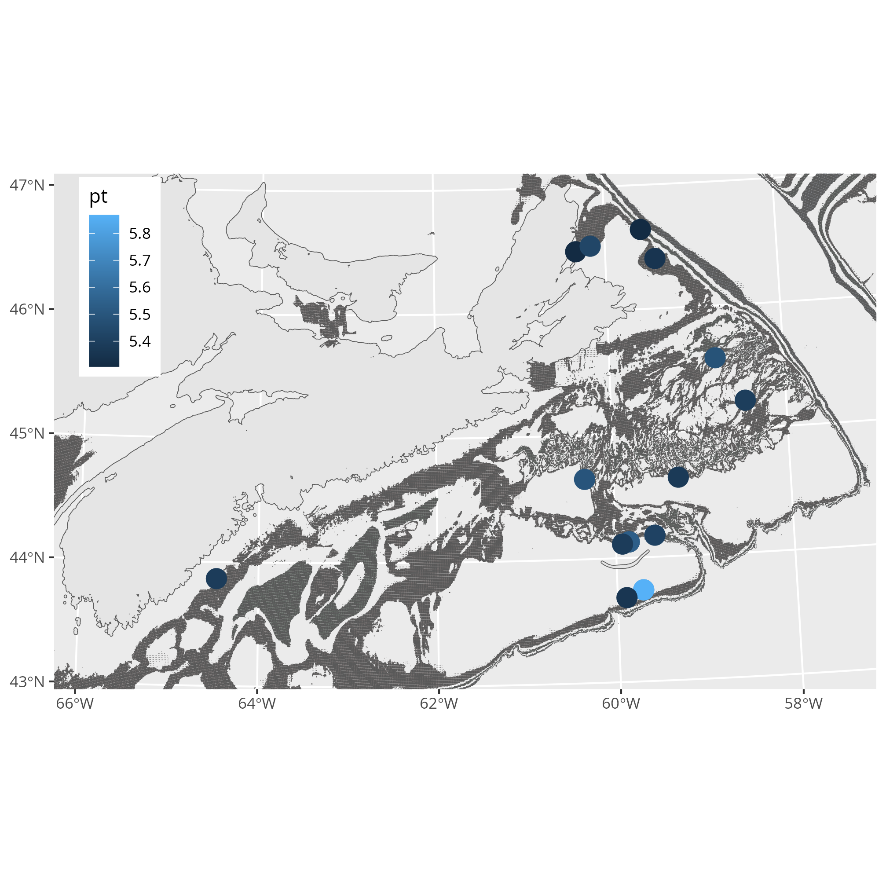


```{r}
#| eval: false
#| output: false
#| echo: false
#| label: spatial-density-hotspots

# directly from databases
M = snowcrab.db( DS="set.complete", p=p ) # note depth is log transformed here
setDT(M)

# high density locations  
i = which(M$totno.all > 2*10^5)
H = M[i, .(uid, plon, plat, towquality, dist, distance, surfacearea, vessel, yr, z, julian, no.male.all, no.female.all, cw.mean, totno.all, totno.male.imm, totno.male.mat, totno.female.imm, totno.female.mat, totno.female.primiparous, totno.female.multiparous, totno.female.berried)]

H$log10density = log10(H$totno.all)

library(ggplot2)
pg=areal_units( p=p ) 
cst = coastline_db( p=p, project_to=st_crs(pg) ) 
  
isodepths = c(100, 200, 300)
isob = isobath_db( DS="isobath", depths=isodepths, project_to=st_crs(pg))
isob$level = as.factor( isob$level)
  
plt = ggplot() +
    geom_sf( data=cst, show.legend=FALSE ) +
    geom_sf( data=isob, aes( alpha=0.1, fill=level), lwd=0.1, show.legend=FALSE) +
    geom_point(data=H, aes(x=plon, y=plat, colour=log10density), size=5) +
    coord_sf(xlim = c(270, 940 ), ylim = c(4780, 5200 )) +
    theme(legend.position="inside", legend.position.inside=c(0.08, 0.8), 
        axis.title.x=element_blank(),
        axis.title.y=element_blank())

fn_plt = file.path( figures_dir, "map_highdensity_locations.png" )
 
ggsave(filename=fn_plt, plot=plt, dpi=288 )

```


#### Post-stratified weights 

In this section, we estimate post-stratified weighting factors and apply them to obtain a "model-based" estimate of size structure. The caveat that needs to be emphasized being that a model is never perfect and can always be improved with the addition of more samples, informative covariates and better functional model forms.

We obtain the individual level data of size measurements from snow crab surveys ("size_data") and create the prediction surface ("carstm_inputs") for every combination of discretized size, location and time. We use a logarithmic scale for size to describe the overall shape of the distribution. The *aegis* package assists with covariate handling and prediction surface generation. Alternatively, one can create the prediction fields directly depending upon available data (see the function: model_size_data_carstm.R for hints). 

```{r size-data}
#| eval: true
#| output: false
#| echo: false
#| label: size-data
  
# prepare the data 
model_size_data_carstm( p=p, redo=c("carstm_inputs", "size_data") )  
```

The statistical model utilized is a Generalized Linear "mixed" effects binomial model. This is completed separately for each sex and maturity class as memory requirements and computational time are limiting, especially when data series are large as we have for snow crab. We use [INLA](https://www.r-inla.org/home) as the underlying computational engine due to its power, flexibility and ability to represent numerous forms of random effects under a Bayesian framework. Other modeling approaches and engines can be used but performance can vary.

In our model, there is only a single fixed component, the global intercept (overall mean):

$$
\boldsymbol{X}^{T}\boldsymbol{\beta} = \text{constant intercept},
$$

and a multiplicative, structured random component $F(\cdot)$ each scaled to mean of 0 on the  logarithmic scale:

$$
\boldsymbol{\epsilon} = F( \text{size}, \text{size x year}, \text{size x space}, \\   
\text{temperature}, \text{depth}, \text{substrate gain size}, \\ 
\text{space}, \text{year}, \text{season}, \text{space x year} ).
$$
  
Each random spatial component follows a Conditional AutoRegressive (CAR) structure, random time components follow an AutoRegressive structure with lag of 1 year (AR1), and all other covariates follow a Random Walk (RW2) structure. Simpler or more complex forms can be used and ultimately represents a balance between computational resources, complexity, interpretability, time;  information availability; and model stability. The caveat being that there is no definitive truth, but rather a constant and iterative struggle to bring to bear additional relevant information and model structure to improve our understanding of the system. The above random effects are extremely simplistic (there are few constraints and assumptions) and therefore considered more robust.


```{r size-model}
#| eval: true
#| output: false
#| echo: false
#| label: size-model
  
# separate models by sex and maturity 
# even if started close to good parameterizations, it can take 12 hrs for 
# each bioclass

num.threads = "3:-1" # for parallel processing INLA options, -1 means try to be clever

for ( bioclass in c(   "m.imm", "f.imm", "f.mat", "m.mat" )) {
    p$bioclass = bioclass
    fit = model_size_presence_absence( p=p, todo="redo", num.threads=num.threads )
    fit = NULL; gc()
}

# extract relavent data and compute post-stratified weights
O = model_size_results( p=p, todo= "post_stratified_weights_redo", only_observations=FALSE  ) 


  if (0) {
	# degugging:      
    bioclasses = c("f.imm", "f.mat", "m.imm", "m.mat", "all")

    p$bioclass = bioclasses[1]
    p$bioclass = bioclasses[2]
    p$bioclass = bioclasses[3]
    p$bioclass = bioclasses[4]
    p$bioclass = bioclasses[5]

    M = model_size_data_carstm( p=p )  
    
    hist((as.numeric(as.character(M$cwd[M$pa==1]))), "fd")  
    
    plot(jitter(pa) ~ cwd, M, pch=".") # zeros extend beyond to give "prior" info to upper size ranges  (male, female)
    
        # males -- variance compression: 2002  
        # females -- variance compression: 2000:2003, 2012, 2013, 2018 (low abundance periods)

    plot(jitter(pa) ~ dyear, M, pch="." ) # no season-bias (male, female)
  
    plot(dyear ~ year, M, pch="." )  # time-bias up to 1999:2004 (male, female)
    plot(t ~ dyear, M, pch="." )  # seasonal temperature bias (male, female)
    plot(z ~ dyear, M, pch="." )  # seasonal depth bias (male, female) --shallows in winter Dec-Jan

    # observed presence is spanned by observed absence (ie. safely goes beyond distribution ) (male, female)
    plot(jitter(pa) ~ t, M, pch=".")
    plot(jitter(pa) ~ z, M, pch=".")  # shallow areas sampled in winter (weather)
  
    rm(M); gc()

    fit = model_size_presence_absence( p=p )

    summary(fit) 

    # compare to data to predictions
    M = model_size_data_carstm( p=p )  

    cor( M$pa, fit$summary.fitted.values$mean, use="pairwise.complete.obs" )

    # posterior predictive check
    carstm_posterior_predictive_check(p=p, M=M[ , ]  )

    # EXAMINE POSTERIORS AND PRIORS
    res = carstm_model(  p=p, DS="carstm_summary" )  # parameters in p and summary

    # posteriors and effects plots

    # set level data from snow crab surveys 
    # sppoly=areal_units( p=p )
      
    # p$space_name = sppoly$AUID 
    # p$space_id = 1:length(p$space_name)  # must match M$space

    # p$time_name = as.character(p$yrs)
    # p$time_id =  1:p$ny

    # p$cyclic_levels = factor( discretize_data( span=c(0, 1, p$nw), toreturn="midpoints" ), ordered=TRUE ) # default midpoints; same as:
    # p$cyclic_name = as.character(p$cyclic_levels)
    # p$cyclic_id = 1:p$nw

    outputdir = file.path(p$modeldir, bioclass)

    res_vars = c( names( res$hypers), names(res$fixed) )
    for (i in 1:length(res_vars) ) {
      o = carstm_prior_posterior_compare( fit, vn=res_vars[i], outputdir=outputdir  )  
      dev.new(); print(o)
    }     

    plot( jitter(M$pa), fit$summary.fitted.values$mean, pch="." ) 
    cor( jitter(M$pa), fit$summary.fitted.values$mean ) # 0.5441

    vns = names(fit$summary.random)

    vn = vns[ grep( ".*cwd,", vns) ]
    o = fit$summary.random[[vn]]
    plot( o$ID, (o$mean) )

    vn = vns[ grep( ".*z,", vns) ]
    o = fit$summary.random[[vn]]
    plot( o$ID, (o$mean) )

    vn = vns[ grep( ".*t,", vns) ]
    o = fit$summary.random[[vn]]
    plot( o$ID, (o$mean) )

    o = fit$summary.fixed
    plot( (o$mean) )


    ## to add spatial effects:
    yrs = 1999:2024

    spec_bio = bio.taxonomy::taxonomy.recode( from="spec", to="parsimonious", tolookup=2526 )

    snowcrab_filter_class = "fb"     # fishable biomass (including soft-shelled )  "m.mat" "f.mat" "imm"

    carstm_model_label= paste( "male_size_structure" )
    carstm_model_label= paste( "female_size_structure" )

    io = which(M$tag=="observations")
    ip = which(M$tag=="predictions")

    iq = unique( c( which( M$totno > 0), ip ) )
    iw = unique( c( which( M$totno > 5), ip ) )  # need a good sample to estimate mean size


    ylab = "Probability"
    fn_root_prefix = "Predicted_presence_absence"
    fn_root = "habitat"
    # title= paste( snowcrab_filter_class, "Probability")  

    outputdir = file.path( p$modeldir, bioclass, "figures" )
    if ( !file.exists(outputdir)) dir.create( outputdir, recursive=TRUE, showWarnings=FALSE )

    # plots with 95% PI
    carstm_plot_marginaleffects( p, outputdir, fn_root )

  }
 
```

Now that we have predicted probabilities $\theta_i$ for each individual observation, and for each stratum $\theta_a$, we can compute post-stratification weights $\omega_i$ from the joint posteriors to carry them forward for further Bayesian analysis and synthesis. Here we will use the point estimates of posterior means for a quick summary.

```{r post-stratification-weights}
#| eval: true
#| output: false
#| echo: false
#| label: post-stratification-weights

# bring/glue all mats and sexes together into a single table 
# where each row is an individual observation
# with associated computed weights and correction factors
 
# O = model_size_results( p=p, todo= "post_stratified_weights_redo", only_observations=FALSE  ) # n=1106430  including prediction even if none were found

O = model_size_results( p=p, todo= "post_stratified_weights"  ) # n=532176    

O$year = as.numeric(as.character(O$year) )

plot( O$individual_prob_mean, O$auid_prob_mean, pch="." )  # observations tend to slightly under-represent areal units
  
cor( (O$individual_prob_mean), (O$auid_prob_mean), use="pairwise.complete.obs") 
# 0.860

hist(log10(O$post_stratified_ratio), "fd") 

hist(log10(O$post_stratified_ratio_obs), "fd")   # without seasonal timeshift

summary(O$post_stratified_ratio) # with seasonal shift

#    Min.  1st Qu.   Median     Mean  3rd Qu.     Max. 
# 0.00209  0.99998  1.00573  1.07681  1.04370 40.52438 


summary(O$post_stratified_ratio_obs)  # without seasonal timeshift
#   Min. 1st Qu.  Median    Mean 3rd Qu.    Max. 
# 0.0226  1.0000  1.0057  1.0717  1.0428 32.7205 


sa_vars = list(
  cfanorth = "cfanorth_sa", 
  cfasouth = "cfasouth_sa", 
  cfa23    = "cfa23_sa", 
  cfa24    = "cfa24_sa", 
  cfa4x    = "cfa4x_sa", 
  cfaall   = "cfaall_sa"  # all are in km^2 
)


# variable name containing sa estimates for the sub-domain of interest
region = "cfaall"
# region = "cfanorth"
# region = "cfasouth"
# region = "cfa4x"
# region = "cfa23"
# region = "cfa24"

O$SA = O[[sa_vars[[region]]]]

```

We note that we must account for irregular numbers of sampling events (tows) within a given stratum, including missing samples due to incomplete surveys. This is to ensure that contributions of individual observations where an areal unit is over-sampled does not create bias in the predicted distribution. *Similarly when an areal unit is not sampled, – the surface area associated with the unsampled area is iteratively allocated proportionaly to adjacent neighbours 


```{r normalize-weights}
#| eval: true
#| output: false
#| echo: false
#| label: normalize-weights

# normalization by sampling station intensity
O$wgt = O$post_stratified_ratio / O$data_offset / O$n_stations  

 
hist(log10(O$wgt), "fd") 
summary(O$wgt)
#    Min.  1st Qu.   Median     Mean  3rd Qu.     Max. 
#    1468   129498   188276   227038   278055 10 247 932 


# check some histograms
yrp = "2024"
#yrp = "2023"
#yrp = "2022"
#yrp = "2021"
#yrp = "2019"

# note: wgt > 0 filters out other regions 

females = O[  sex==1 & wgt>0 & year==yrp, which=TRUE]
males   = O[  sex==0 & wgt>0 & year==yrp, which=TRUE]


k = females
k = males  

 
nbins= 50

p_no_labels = theme(
  axis.title.x=element_blank(),
  axis.text.x=element_blank(),
  axis.ticks.x=element_blank()
) 

p_psw = ggplot( O[k,], aes( (cw), group = mat, fill=mat, weight=wgt) ) + 
  geom_histogram( bins =nbins )  
 
p_offset = ggplot( O[k,], aes( (cw), group= mat, fill=mat, weight=data_offset)  ) + 
  geom_histogram( bins =nbins )  

p_nw = ggplot( O[k,], aes( (cw), group= mat, fill=mat )  ) + 
  geom_histogram( bins =nbins )   


labels = paste( 
  c( 
    "Weighted (post-stratified):", 
    "Density  (sampling offset; no/km^2): ", 
    "Unweighted (no observed): "
  ),
  paste(  region, yrp, sep="-")
) 

dev.new()
ggpubr::ggarrange( 
  p_psw + p_no_labels, 
  p_offset + p_no_labels, 
  p_nw, 
  ncol=1, 
  labels=labels, 
  align = "v", 
  font.label=list(size=10) 
)

# NOTE: wgt >0 is useful to remove estimates outside of a focal subregion

female = "1" 
male = "0" 

f = which( O$wgt>0 & O$sex==female )

m = which( O$wgt>0 & O$sex==male )

m.gt.95 = which( O$wgt>0 & O$sex==male & O$cw>=95 )

i = f
i = m
i = m.gt.95
 

o = O[ i, .(
    mass_density=sum(mass * data_offset),  # assuming completely random sampling
    mass_total_psw_kt=sum(mass * wgt * SA ) / 10^6    # with envir correction
  ), 
  by=.(year, sex, mat) ]  

# weighted total 
ggplot( o, aes(x=year, y=mass_total_psw_kt, group=mat, col=mat) ) + 
  geom_point() +
  geom_line()

# density
ggplot( o, aes(x=year, y=mass_density, group=mat, col=mat) ) + 
  geom_point() +
  geom_line()
 


# --- 2019 data offsets are very small:

# large corrections: might have to trim these to make more robust
i = which(O$SA_ratios > 1e6)  
O[i, .N , by=.(sid)][order(sid),]
           sid     N

           
O[i, .N , by=.(AUID)] ; 
      AUID     N


O[i, .N , by=.(year)][order(year),]
    year     N


```


Bottom line: reasonable success in estimating individual survey/design weights.  And operationally viable (~ 4 days of computation). These model-based size distributions respect/account for unmeasured spatial and temporal effects and measured environmental structure and as such are more flexible and less biased representations than blindly assuming exchangeablity at the individual level (*iid*). 


#### Size bias/selectivity

The application of the above post-stratified weights provides a distribution that scales observations of individuals to observed environmental conditions. However, there is also bias associated with size, often referred to as sampling gear "selectivity". In fishery applications this bias is usually estimated in a process-based dynamical model as a residual nuisance factor or estimated *apriori* via experimentation and then deterministically used to correct size-distributions. 

An alternative to the above is to estimate the size-related effects in our binomial model as the size-based probability of "observability"; that is, the marginal effect of size on the probability of observing individuals provides a parameterization of size-bias. Removing size-related effects from the probabilities associated with individuals will, therefore, provide probability estimates that adjusts for size-related sampling/design bias. We do this by removing the random effects associated with size in the posterior estimates. These were actually stored in the previous step and can be accessed as follows. 


```{r post-stratification-size-bias}
#| eval: true
#| output: false
#| echo: false
#| label: post-stratification-size-bias
 
# look at size selectivity (bias) curve:

sbias = size_bias_compute(p)

plot(  ( sbias[,bias]) ~  ( sbias[,log_cwd])) #  log odds ratio


# apply it to observation weights via spline
 
O$bias =  NA

for (bc in c("f.imm", "f.mat", "m.imm", "m.mat") ) {
  ii = which(O$bioclass== bc)
  ss = sbias[ bioclass==bc , ]
  oo = log(O$cw[ ii ] )
  O$bias[ii] = spline(
      x = ss$log_cwd , 
      y = ss$bias, 
      xmin=min(oo), xmax=max(oo),
      xout=oo
  )$y
}
 
O$wgt_bc = O$wgt / exp(O$bias) # correct  size bias
 
hist(log10(O$wgt_bc), "fd")

hist(log10(O$wgt), "fd") 

summary(O$wgt_bc)


p_psw2 = ggplot(O[k,], aes( (cw), group= mat, fill=mat, weight=wgt_bc )  ) +
  geom_histogram( bins =nbins )  

labels = paste( 
  c( 
    "Weighted (post-stratified size unbiased):", 
    "Weighted (post-stratified):" 
  ),
  paste(  region, yrp, sep="-")
) 

dev.new()
ggpubr::ggarrange( 
  p_psw, 
  p_psw2 + p_no_labels  + ylim(0, 1e10), 
  ncol=1, 
  labels=labels, 
  align = "v", 
  font.label=list(size=10) 
)


f.imm = O[ mat==0 & sex==1 & wgt>0 & year==yrp, which=TRUE]
m.imm = O[ mat==0 & sex==0 & wgt>0 & year==yrp, which=TRUE]

f.mat = O[ mat==1 & sex==1 & wgt>0 & year==yrp, which=TRUE]
m.mat = O[ mat==1 & sex==0 & wgt>0 & year==yrp, which=TRUE]

k = m.imm
k = f.imm
k = m.mat
k = f.mat
 

ggplot(O[k,], aes( (cw), weight=wgt )  ) + 
  geom_histogram( bins =nbins )  + 
  scale_x_continuous(trans='log10') + 
  scale_y_continuous(trans='log10')


```

The above are mean estimates. The posterior predictions with these effects removed is computed by returning to the internal representation of these values (log odds ratios and *logit* probabilities) in INLA. These samples are extracted and saved in the next step.


```{r post-stratification-size-bias-samples}
#| eval: true
#| output: false
#| echo: false
#| label: post-stratification-size-bias-samples

# look at size selectivity (bias) curve:
# choose region of interest
region = "cfaall"
region = "cfanorth"
region = "cfasouth"
region = "cfa4x"
region = "cfa23"
region = "cfa24"


-- todo 

ss = model_size_results( p=p, todo="size_selectivity", region=region )

plot( ( ss[,2]) ~ exp( ss[,1])) #  log odds ratio

plot(exp( ss[,2])~ exp( ss[,1]))  # odds ratio

plot(1/exp( ss[,2])~ exp( ss[,1])) # selectivity ratio

n = nrow(ss) # n is the number of discretizations in the model fit for cwd

# choosing a location/time slice at random and plotting it
  a = 776; 
  a = 1;
  i = a*n+(1:n); 
  plot(exp( ss$mean[i])~exp( ss$ID[i])) 

```


## 2. Inference of modal sizes by stage and growth

In order to develop a stage-based (sex, instar, maturity group) representation of snow crab, we need to be able to identify modal size groups associated with each such stage. This can be done by tracking growth/moult increments from laboratory rearing, mark-recapture or inferred from individual size measurements in a survey. Like most organisms, snow crab demonstrate plasticity in growth, as such properly simulating the natural environment in tanks is both important and difficult; and usually result in high natural mortality; while mark-recapture of immature crab is not possible due to difficulties of tag retention through semi-annual to bi-annual molting frequencies. 

As such, here, we focus upon the third approach, inference from measurements derived from population surveys. This inference can be accomplished with the selectivity-corrected or selectivity-uncorrected size distributions from *Section 1* as a basis. Or, though it is not recommended, one can use the naive size-frequency distributions, if exchangeable *iid* assumptions can be asserted to be valid. 
    
From simple kernel density representations of size frequency at small area unit scale, determine the magnitudes of modes. This is done as there may be regional and time-dependent changes in modal sizes (year-classes). Sex and maturity status are determined from observation and inferred from size-shape changes (carapace width to chela height males or abdominal flap width for females). Inference of modal sizes for each sex-maturity group are determined in order to develop a growth model.

### Computation

#### Kernel density modes

The algorithm for mode detection is simple: a local smooth kernel density representation of size frequency distributions are estimated for each small area and time unit boosted by data from adjacent neighbours and time slices. This is done as there may be regional and longer time-dependent changes in growth rates due to strong variations in environmental structure (temperature, depth, substrate, predator and prey fields, etc.). Some minor tuning of bandwidth size is required to resolve stages as they have divergent size ranges and exponential growth increments.


```{r}
#| eval: true
#| output: false
#| echo: false
#| label: size-normalization

# Normalization via weighted kernel density data from "base-data"
 
# key defaults that define kernal densities:
np = 512  # # discretizations in fft

xr = round( log(p$xrange), digits=2 ) 
ldx = diff(xr)/(np-1)  # 0.005988
xvals = seq( xr[1], xr[2], by=ldx )

# bw is on log scale ... approx (log) SD for each interval  
#  data_resolution is ~1 to 2 mm (observation error)
#  but some catgories are wider than others :
#   male imm  = 10 to 100 mm
#   male mat  = 60 to 168 mm
#   female imm = 10 to 45 mm
#   female mat = 35 to 65 mm

# bw = 0.1 # ~ 20 ldx ~ overly smooth
# bw = 0.05  # used for modal analysis
# bw = 0.025  # optimal for sparse data  <<<<<< DEFAULT for histograms >>>>>>
# bw = 0.01 # 2 ldx is too noisy for arithmetic but good for geometric means

# class-specific band widths
bw =list( 
  "0"=list("0"=0.05, "1"=0.05), #male( imm, mat)
  "1"=list("0"=0.04, "1"=0.04 ) #female( imm, mat)
)

# years of interest:
years = as.character( yrs )

ti_window=c(-4,4)  # include data from +/1 4 weeks 
sigdigits = 3

lowpassfilter=0.001
lowpassfilter2=0.001

# moving average in space and time .. sa-weighted kernel density by sid, sex, mat (with au and quarter)
  
redo =TRUE
# redo = FALSE
 
# compute kernel density estimates
M = size_distributions(p=p, toget="kernel_density_weighted", 
  bw=bw, np=np, ldx=ldx,  
  Y=years, pg=pg, sigdigits=sigdigits, ti_window=ti_window,  
  outdir=ss_outdir, redo=redo ) 
 
```

Using these local smoothed distributions, weighted geometric mean densities (with a small positive offset to approximate density detection limit of 100 individuals / km^2) are determined for each stratum (year, areal unit, sex, maturity and discretized carapace width) and stratum-specific local modes are identified. 

  

   

```{r}
#| eval: true
#| output: false
#| echo: false
#| label: size-modes-strata
 
# identify modes of modes from kernel density estimates when there is enough data

nmin = 3
bw2 =list( 
  "0"=list("0"=0.03, "1"=0.03 ), #male( imm, mat)
  "1"=list("0"=0.03, "1"=0.03 ) #female( imm, mat)
)

M = size_distributions(p=p, toget="kernel_density_modes", 
  bw=bw2, np=np, 
  Y=years, pg=pg, sigdigits=sigdigits, n_min=nmin,
  lowpassfilter=lowpassfilter, lowpassfilter2=lowpassfilter2,  outdir=ss_outdir,
  redo=redo )

```


*NOTE: Consider moving this to Julia*

In a subsequent global evaluation at the domain level, kernel density smoothing of these modes are used to find the main clusters of modes and classified as candidate domain-level modal sizes of instars for each sex-maturity group.


The latter classification step is based upon prior information on instar growth curves from observations and published information in the literature.


For males:


and then tweaked a bit as carapace width cannot shrink:


For females:


and then tweaked a bit as carapace width cannot shrink:


```{r}
#| eval: true
#| output: false
#| echo: false
#| label: size-modes-domain
 
# find most frequent peaks and valleys .. if recreating this, stepping through the function is probably best 
# as there are many decisions that need to be made   
bw3 =list( 
  "0"=list("0"=0.03, "1"=0.03 ), #male( imm, mat)
  "1"=list("0"=0.03, "1"=0.03 ) #female( imm, mat)
)

mds = size_distributions(p=p, toget="modal_groups", bw=bw3, np=np, ldx=ldx, 
  M=M, 
  sigdigits=sigdigits, lowpassfilter2=lowpassfilter2, outdir=ss_outdir, redo=redo )
```


```

These are the results:

Female growth of modes (t vs t-1)

```output

summary( lm(formula = logcw ~ logcw0 * mat, data = mds[sex == "f", ], 
    na.action = "na.omit") )

Residuals:
     Min       1Q   Median       3Q      Max 
-0.06112 -0.01220  0.00077  0.01119  0.05588 

Coefficients:
            Estimate Std. Error t value Pr(>|t|)
(Intercept)   0.2558     0.0819    3.12   0.0206
logcw0        1.0167     0.0248   40.93  1.4e-08
matm         -1.7146     0.3592   -4.77   0.0031
logcw0:matm   0.4026     0.0929    4.33   0.0049

Residual standard error: 0.0367 on 6 degrees of freedom
  (4 observations deleted due to missingness)
Multiple R-squared:  0.997,	Adjusted R-squared:  0.996 
F-statistic:  779 on 3 and 6 DF,  p-value: 3.67e-08
 
```

Male growth of modes  (t vs t-1)

```output

summary( lm(formula = logcw ~ logcw0 * mat, data = mds[sex == "m", ], 
    na.action = "na.omit") )

Residuals:
     Min       1Q   Median       3Q      Max 
-0.07578 -0.01237  0.00164  0.01968  0.05031 

Coefficients:
            Estimate Std. Error t value Pr(>|t|)
(Intercept)  0.16958    0.07278    2.33    0.053
logcw0       1.03569    0.02079   49.81  3.4e-10
matm        -0.17502    0.37497   -0.47    0.655
logcw0:matm  0.00467    0.09023    0.05    0.960

Residual standard error: 0.04 on 7 degrees of freedom
  (5 observations deleted due to missingness)
Multiple R-squared:  0.998,	Adjusted R-squared:  0.997 
F-statistic: 1.05e+03 on 3 and 7 DF,  p-value: 1.2e-09

```

### Growth 

The overall growth patterns of snow crab is reasonably well understood. Due to short moult cycles of less than a year in the early stages, growth can be monitored reasonably. However beyond a size range of approximately XX mm, inter-molt periods can be 1 or more years in length. Longevity of snow crab can be from 11 (females) to 15 (males) years. Long term rearing of snow crab is a challenge as living conditions are generally less than ideal or at least different in substantial ways from a natural environment, especially for the larger sized organisms. This can of course create selection biases, such as stunting due to environmental stress (over-crowding, feeding irregularities, water quality, etc.). 

There also seems to exist inter-individual and regional-variability in growth patterns due to the interplay between environmental (especially bottom temperatures and resource availablity) and potentially genetic factors at large geographic scales, depending upon oceanic currents. Mark-recapture studies can inform such inference for many species, however, in snow crab, due to the loss of external tags during molts or difficulty and expense of internal tags, this cannot be used effectively.

Observations in more natural settings are also possible by scuba or remote operated vehicle/camera systems. However, such information is quite costly and resource intensive and also susceptible to selection bias in that recaptured or surviving animals tend to be those in better physiological condition than average and so can result in expectations of overly optimistic growth patterns. When routine sampling occurs, a more cost-effective way to establish or corroborate these growth patterns is to decompose observed size frequency distributions. Though there is also inherent size-selection biases in such data due to size-related behavior (habitat preferences) and capture efficiency (net size, speed, depth) that changes with different size and stages, it is still possible to extract some meaningful information of size modes from such data and infer growth patterns.

Given some set of observations of size frequency, subjective "best guesses" (classification by "eye") and implicit reasoning can be used to establish and classify these growth modes. When groups are distinct, this is reasonable. However, observations of size frequencies often demonstrate a mixture of distributions that are heavily overlapping. Even the most state-of-the-art computational
algorithms cannot fit such distributions easily. One of the leading more objective approaches to estimate classification using point estimates of latent parameters became available with the development of the Expectation-Maximization (EM) algorithm operating in an Maximum Likelihood framework (Dempster et al 1977; see also the closely related Kalman Filter (Roweis and Ghahramani 1999) and for distributions in Bayesian frameworks with Variational Inference (Nguyen 2023) and general latent Bayesian Inference. Here we use the latter method, more specifically, *Latent Bayesian Kernel Mixture Model (LBKMM)*, using population census-based data to identify growth stanzas using snow crab data derived from the Maritimes Region of Atlantic Canada.  


### Mixture of distributions

The use of a mixture of distributions has a long history. Pearson (1894) where it was used to identify/classify species of crabs. Holmes (1892) also studied mixture models of wealth disparity.  Most numerical methods assigning or classifying data into a cluster or group generally requires the number of such groups to be specified *apriori*. The exception being, Infinite Mixture Models (Ghahramani 2011). Fortunately, we have a reasonable understanding of the number of approximate modes of instar carapace widths from visual analysis of size-frequency distributions.  

The finite form of the problem is well known and understood. Implementation is usually with Maximum likelihood using an Expectation-Maximization algorithm (EM; Dempster, Laird, & Rubin, 1977). The solutions to such problems are dependent upon the number of modes chosen, or often the location of the modes, apriori. Many tools exist for estimation:

- https://cran.r-project.org/web/packages/mixtools/vignettes/mixtools.pdf

- https://cran.r-project.org/web/packages/flexmix/vignettes/bootstrapping.pdf

- https://statmath.wu.ac.at/~gruen/BayesMix/bayesmix-intro.pdf

must specify constant node using mcmc Jags

<https://cran.r-project.org/web/packages/mclust/vignettes/mclust.html>

problems

<https://arxiv.org/pdf/2007.04470>


<https://dr.lib.iastate.edu/server/api/core/bitstreams/333bb46d-c759-4202-8f41-0e921271de53/content>

good reviews <https://snunnari.github.io/SBE/mclachlan.pdf>

<https://en.wikipedia.org/wiki/Mixture_model?wprov=sfti1>

<https://www.sciencedirect.com/topics/medicine-and-dentistry/mixture-model>


We can cluster the data using a Bayesian mixture model. The aim of this task is to infer a a latent grouping (hidden structure) from unlabelled data.


Unidimensional Kernel Mixture model with K pre-specified components that cover the space

$\\alpha$ = concentration parameter of 1 (or k, the dimension of the
  Dirichlet distribution, by the definition used in the topic modelling
  literature) results in all sets of probabilities being equally likely, i.e.,
  in this case the Dirichlet distribution of dimension k is equivalent to a
  uniform distribution over a k-1-dimensional simplex. This is not the same as
  what happens when the concentration parameter tends towards infinity. In the
  former case, all resulting distributions are equally likely (the distribution
  over distributions is uniform). In the latter case, only near-uniform
  distributions are likely (the distribution over distributions is highly
  peaked around the uniform distribution).

label="observation (i)", ylabel="cluster (k)", legend=false, ) end


https://turing.ml/dev/tutorials/01-gaussian-mixture-model/

#### Finite mixtures model

<https://turinglang.org/stable/tutorials/01-gaussian-mixture-model/>

<https://mc-stan.org/users/documentation/case-studies/identifying_mixture_models.html>

we want to infer the mixture weights, the parameters $\mu_i$ and the assignment of each datum to a cluster i

standard normal distributions as priors for $\mu$ and a Dirichlet distribution with parameters $\alpha_i$ as prior for $w$

$$
\begin{aligned} 
\mu_k & \sim \mathcal{N}(0, 1) \qquad (k = 1,\ldots,K) \\
w & \sim \operatorname{Dirichlet}(\alpha_1, \ldots, \alpha_K) \\

z_i & \sim \operatorname{Categorical}(w) \qquad (i = 1,\ldots,N), \\

x_i & \sim \mathcal{N}([\mu_{z_i}, \mu_{z_i}]^\mathsf{T}, I) \qquad
(i=1,\ldots,N).
\end{aligned}

$$

 
#### Results and Discussions

```{table}
                Coef.  Std. Error      t  Pr(>|t|)  Lower 95%  Upper 95%

(Intercept)  1.05187   0.0430406   24.44    <1e-04   0.932365   1.17136
instar       0.321978  0.00640426  50.28    <1e-06   0.304196   0.339759
  
(Intercept)  1.49157    0.216241    6.90    0.0917  -1.25602     4.23917
instar       0.268652   0.0221858  12.11    0.0525  -0.0132459   0.550549
  
(Intercept)  1.10376   0.0259636   42.51    <1e-08   1.04237    1.16515
instar       0.308079  0.00308857  99.75    <1e-11   0.300775   0.315382
  
(Intercept)  0.335281  0.114697     2.92    0.2098  -1.12208    1.79264
instar       0.363371  0.00953601  38.11    0.0167   0.242204   0.484537
```

      
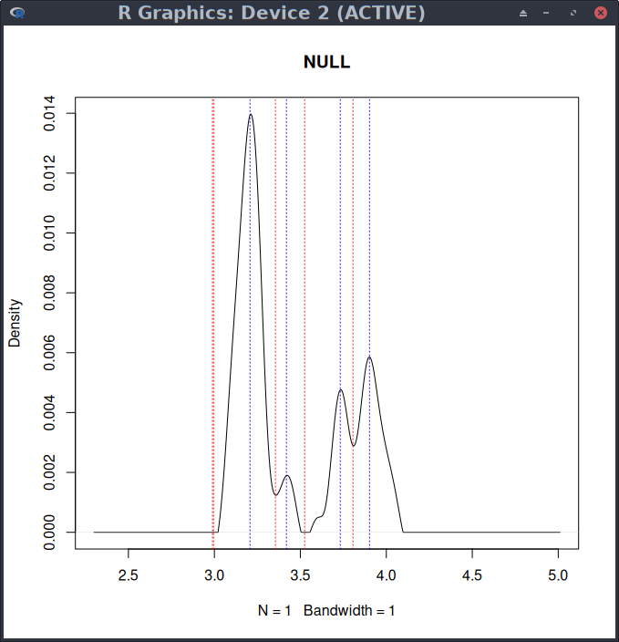

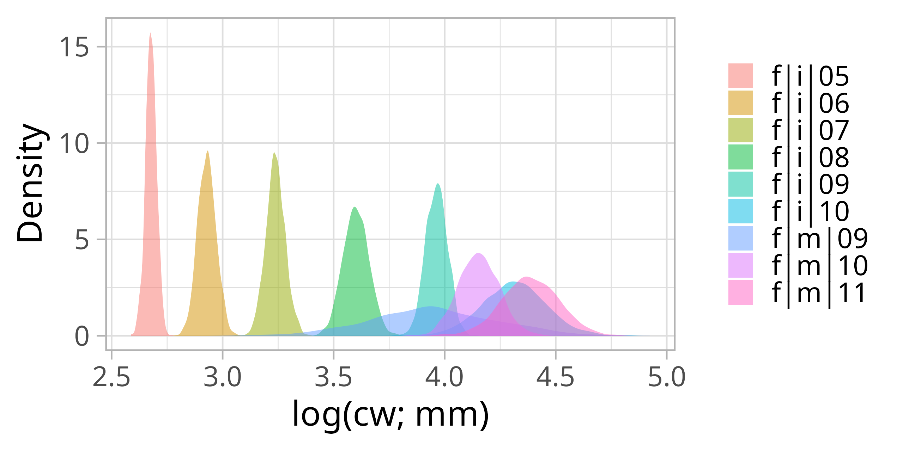

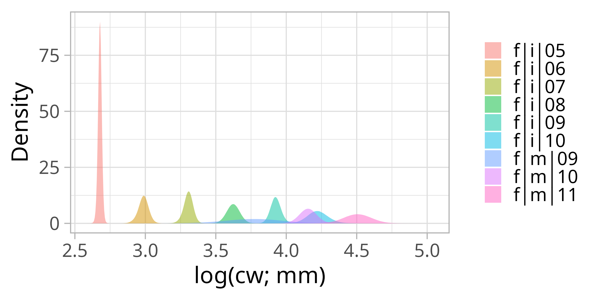

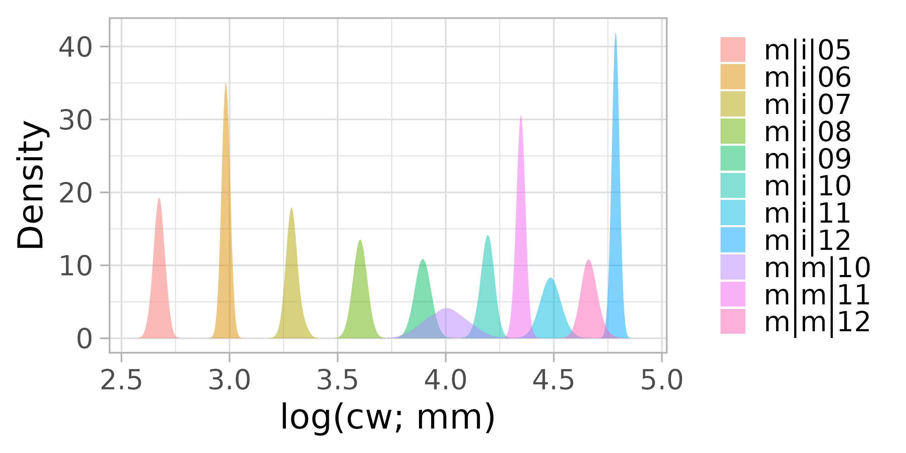

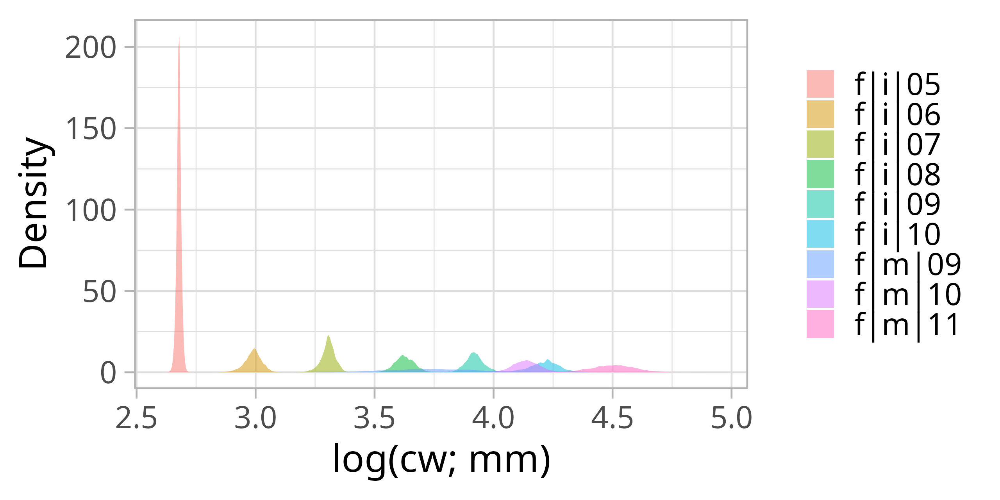

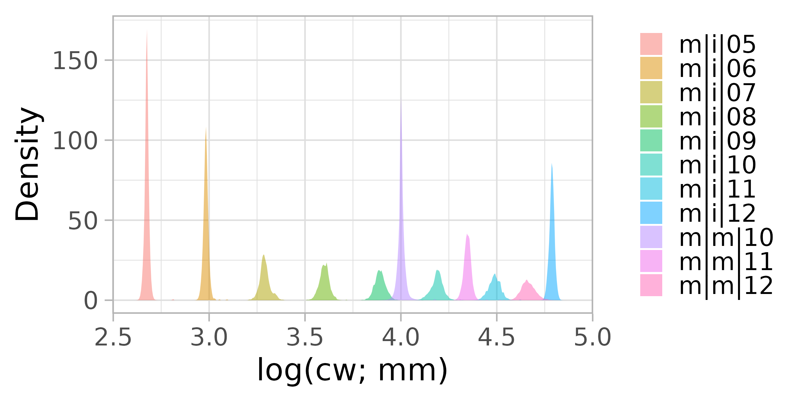

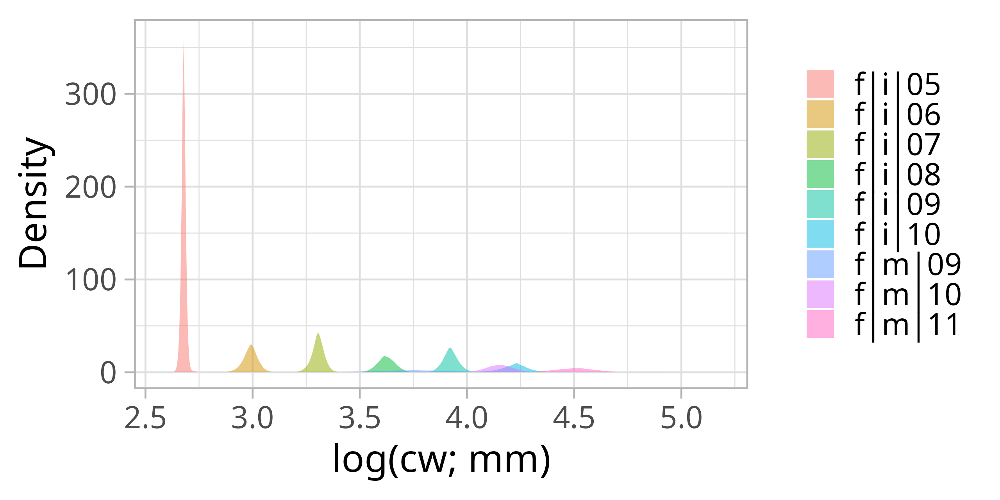

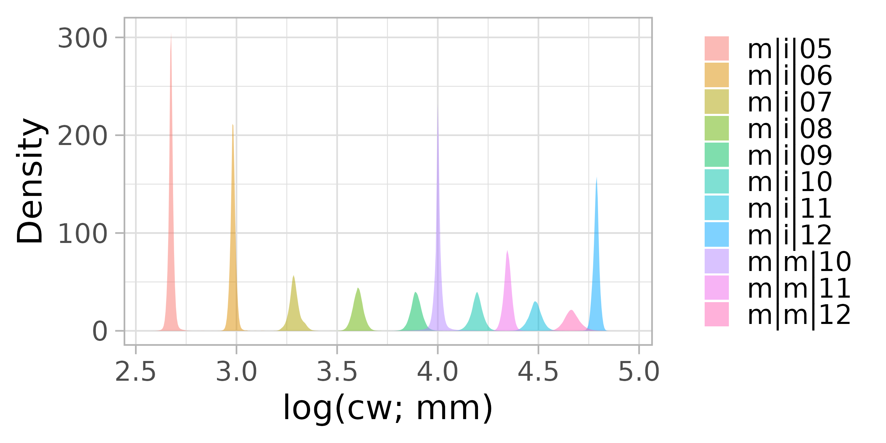

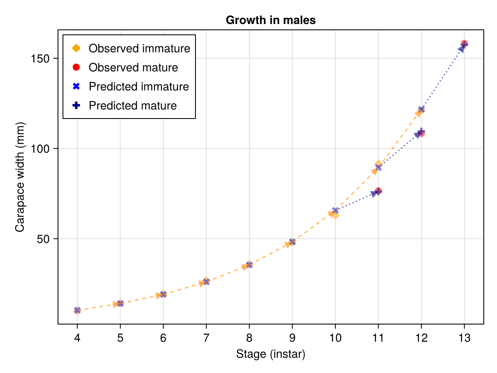

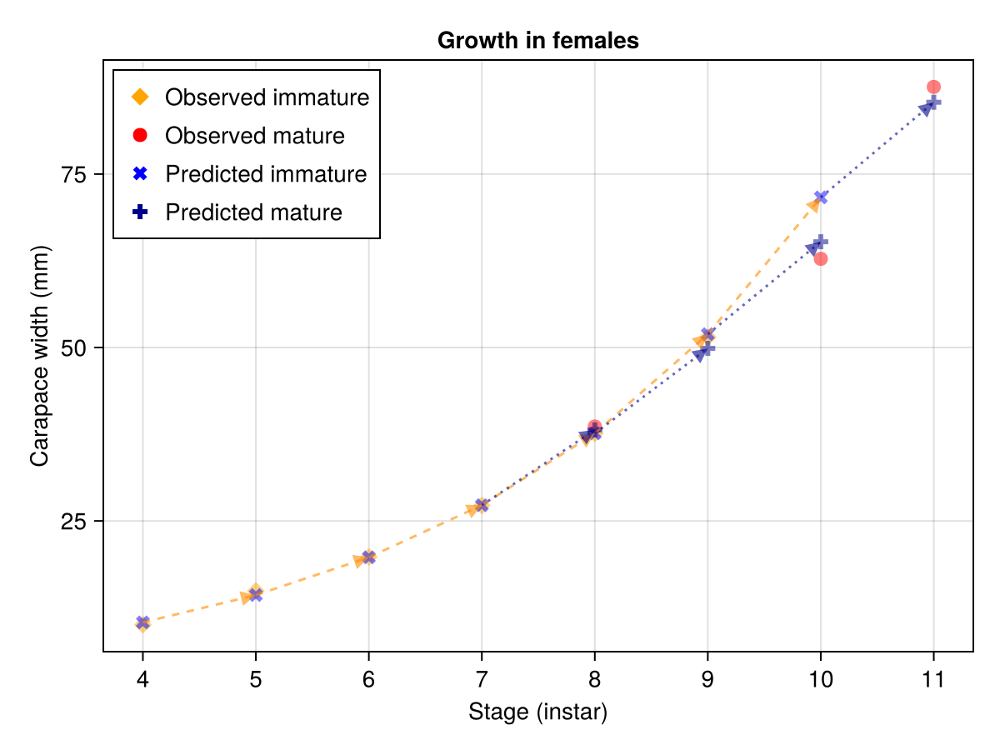

 
 
Female mature simple model: cw vs instar

```output
 
summary( lm(formula = logcw ~ instar, data = mds[sex == "f" & mat == "m", 
    ], na.action = "na.omit") )

Residuals:
      1       2       3 
-0.0253  0.0507 -0.0253 

Coefficients:
            Estimate Std. Error t value Pr(>|t|)
(Intercept)  -0.0157     0.4402   -0.04    0.977
instar        0.4090     0.0439    9.32    0.068

Residual standard error: 0.0621 on 1 degrees of freedom
Multiple R-squared:  0.989,	Adjusted R-squared:  0.977 
F-statistic: 86.9 on 1 and 1 DF,  p-value: 0.068
 
```

Female immature simple model: cw vs instar

```output

summary( lm(formula = logcw ~ instar, data = mds[sex == "f" & mat == "i", 
    ], na.action = "na.omit") )

Residuals:
     Min       1Q   Median       3Q      Max 
-0.05154 -0.00868 -0.00699  0.00403  0.06546 

Coefficients:
            Estimate Std. Error t value Pr(>|t|)
(Intercept)  1.12368    0.04548    24.7  2.9e-07
instar       0.31059    0.00593    52.4  3.2e-09

Residual standard error: 0.0355 on 6 degrees of freedom
  (3 observations deleted due to missingness)
Multiple R-squared:  0.998,	Adjusted R-squared:  0.997 
F-statistic: 2.75e+03 on 1 and 6 DF,  p-value: 3.24e-09

```

Male mature simple model: cw vs instar

```output

summary( lm(formula = logcw ~ instar, data = mds[sex == "m" & mat == "m", 
    ], na.action = "na.omit") )

Residuals:
       1        2        3 
 0.00283 -0.00567  0.00283 

Coefficients:
            Estimate Std. Error t value Pr(>|t|)
(Intercept)  0.65417    0.05413    12.1   0.0526
instar       0.33550    0.00491    68.4   0.0093

Residual standard error: 0.00694 on 1 degrees of freedom
  (1 observation deleted due to missingness)
Multiple R-squared:     1,	Adjusted R-squared:     1 
F-statistic: 4.67e+03 on 1 and 1 DF,  p-value: 0.00931

```

Male immature simple model: cw vs instar

```output

summary( lm(formula = logcw ~ instar, data = mds[sex == "m" & mat == "i", 
    ], na.action = "na.omit") )

Residuals:
     Min       1Q   Median       3Q      Max 
-0.04238 -0.02548 -0.00584  0.02079  0.08236 

Coefficients:
            Estimate Std. Error t value Pr(>|t|)
(Intercept)   1.1912     0.0446    26.7  2.6e-08
instar        0.2994     0.0053    56.5  1.4e-10

Residual standard error: 0.0411 on 7 degrees of freedom
  (3 observations deleted due to missingness)
Multiple R-squared:  0.998,	Adjusted R-squared:  0.997 
F-statistic: 3.19e+03 on 1 and 7 DF,  p-value: 1.43e-10
 
```


### Growth increments

A simple kernel density approach across was used to get a first approximation of growth patterns by identifying frequently occurring modes from size frequency data at areal unit and annual timescales (above).

Now we can try to make this more precise by tracking instars. The kernel mixture modelling decomposes the size density and estimates latent modes of size withing each approximate range of sizes associated with an instar. The assumption is that genetically determined growth trajectory is strong and approximated by  the population level kernel density estimates, and that  variations/deviations from it these are due to variations in the local environmental conditions (resource availability, stress, etc).

These latent modal size estimates, W = log(carapace width; mm).

Load results from previous step and plot some histograms (density):

```{r}
#| eval: false 
#| output: false
#| echo: false
#| label: kmm-growth-stanzas


# histograms of modes
for (sex in c("f", "m")) {
  # sex = "m"

    variabletomodel = "imodes"

    fn = file.path( p$modeldir, paste("psims", "_", sex, "_", variabletomodel, ".rdz", sep="") )
    psims = aegis::read_write_fast( fn )
  
    # flatten for plotting
    sss = rbindlist( lapply( psims, function(x) as.data.table(x)), idcol=TRUE)

    x11()
    o = ggplot( sss, aes( value )) +
      geom_density(aes(fill =.id ), color=NA, alpha = 0.5,  position = "identity") +
      theme_light( base_size = 22) + 
      theme( legend.title=element_blank()) +
      labs(x="log(cw; mm)", y="Density", size = rel(1.5)) 
    fn = file.path( p$modeldir, "figures", paste("density", "_", sex, "_", variabletomodel, ".png", sep="") )
    ggsave( fn, o, width=8, height=4, units="in", dpi=320, create.dir=TRUE )

    x11()
    o = ggplot( sss[time=="2020" ,], aes( value )) +
      geom_density(aes(fill =.id ), color=NA, alpha = 0.5,  position = "identity") +
      theme_light( base_size = 22) + 
      theme( legend.title=element_blank()) +
      labs(x="log(cw; mm)", y="Density", size = rel(1.5)) 
    fn = file.path( p$modeldir, "figures", paste("density_2020", "_", sex, "_", variabletomodel, ".png", sep="") )
    ggsave( fn, o, width=8, height=4, units="in", dpi=320, create.dir=TRUE )

    x11()
    o = ggplot( sss[time=="2021",], aes( value )) +
      geom_density(aes(fill =.id ), color=NA, alpha = 0.5,  position = "identity") +
      theme_light( base_size = 22) + 
      theme( legend.title=element_blank()) +
      labs(x="log(cw; mm)", y="Density", size = rel(1.5)) 
    fn = file.path( p$modeldir, "figures", paste("density_2021", "_", sex, "_", variabletomodel, ".png", sep="") )
    ggsave( fn, o, width=8, height=4, units="in", dpi=320, create.dir=TRUE )

    x11()
    o = ggplot( sss[time=="2020" & space=="500",], aes( value )) +
      geom_density(aes(fill =.id ), color=NA, alpha = 0.5,  position = "identity") +
      theme_light( base_size = 22) + 
      theme( legend.title=element_blank()) +
      labs(x="log(cw; mm)", y="Density", size = rel(1.5)) 
    fn = file.path( p$modeldir, "figures", paste("density_2020_500", "_", sex, "_", variabletomodel, ".png", sep="") )
    ggsave( fn, o, width=8, height=4, units="in", dpi=320, create.dir=TRUE )

    x11()
    o = ggplot( sss[time=="2020" & space=="1",], aes( value )) +
      geom_density(aes(fill =.id ), color=NA, alpha = 0.5,  position = "identity") +
      theme_light( base_size = 22) + 
      theme( legend.title=element_blank()) +
      labs(x="log(cw; mm)", y="Density", size = rel(1.5)) 
    fn = file.path( p$modeldir, "figures", paste("density_2020_1", "_", sex, "_", variabletomodel, ".png", sep="") )
    ggsave( fn, o, width=8, height=4, units="in", dpi=320, create.dir=TRUE )

    x11()
    o = ggplot( sss[time=="2021" & space=="1",], aes( value )) +
      geom_density(aes(fill =.id ), color=NA, alpha = 0.5,  position = "identity") +
      theme_light( base_size = 22) + 
      theme( legend.title=element_blank()) +
      labs(x="log(cw; mm)", y="Density", size = rel(1.5)) 
    fn = file.path( p$modeldir, "figures", paste("density_2021_1", "_", sex, "_", variabletomodel, ".png", sep="") )
    ggsave( fn, o, width=8, height=4, units="in", dpi=320, create.dir=TRUE )

}


# growth increments
compute_growth_increments = FALSE
if (compute_growth_increments) {
  sex = "m"; variabletomodel = "imodes"
  psims = aegis::read_write_fast( file.path( p$modeldir, paste("psims", "_", sex, "_", variabletomodel, ".rdz", sep="") ) )

  y0 = 1:(p$ny-1)
  y1 = 2:p$ny

  grw = list()  # label is the end state

  grw[["m|i|06"]] = psims[["m|i|06"]][, y1, ] - psims[["m|i|05"]][, y0,] 
  grw[["m|i|07"]] = psims[["m|i|07"]][, y1, ] - psims[["m|i|06"]][, y0,] 
  grw[["m|i|08"]] = psims[["m|i|08"]][, y1, ] - psims[["m|i|07"]][, y0,] 
  grw[["m|i|09"]] = psims[["m|i|09"]][, y1, ] - psims[["m|i|08"]][, y0,] 
  grw[["m|i|10"]] = psims[["m|i|10"]][, y1, ] - psims[["m|i|09"]][, y0,] 
  grw[["m|i|11"]] = psims[["m|i|11"]][, y1, ] - psims[["m|i|10"]][, y0,] 
  grw[["m|i|12"]] = psims[["m|i|12"]][, y1, ] - psims[["m|i|11"]][, y0,]

  grw[["m|m|10"]] = psims[["m|m|10"]][, y1, ] - psims[["m|i|09"]][, y0,] 
  grw[["m|m|11"]] = psims[["m|m|11"]][, y1, ] - psims[["m|i|10"]][, y0,] 
  grw[["m|m|12"]] = psims[["m|m|12"]][, y1, ] - psims[["m|i|11"]][, y0,] 


  # growth increments female
  sex = "f"; variabletomodel = "imodes"
  psims = aegis::read_write_fast( file.path( p$modeldir, paste("psims", "_", sex, "_", variabletomodel, ".rdz", sep="") ) )

  grw[["f|i|06"]] = psims[["f|i|06"]][, y1, ] - psims[["f|i|05"]][, y0,] 
  grw[["f|i|07"]] = psims[["f|i|07"]][, y1, ] - psims[["f|i|06"]][, y0,] 
  grw[["f|i|08"]] = psims[["f|i|08"]][, y1, ] - psims[["f|i|07"]][, y0,] 
  grw[["f|i|09"]] = psims[["f|i|09"]][, y1, ] - psims[["f|i|08"]][, y0,] 
  grw[["f|i|10"]] = psims[["f|i|10"]][, y1, ] - psims[["f|i|09"]][, y0,] 

  grw[["f|m|09"]] = psims[["f|m|09"]][, y1, ] - psims[["f|i|08"]][, y0,] 
  grw[["f|m|10"]] = psims[["f|m|10"]][, y1, ] - psims[["f|i|09"]][, y0,] 
  grw[["f|m|11"]] = psims[["f|m|11"]][, y1, ] - psims[["f|i|10"]][, y0,] 

  read_write_fast( data=grw, fn=file.path( p$modeldir, "growth_increments.rdz")  )
}

grw = aegis::read_write_fast( file.path( p$modeldir, "growth_increments.rdz") )


# map the mean growth increments
grwmeans = list()
for (nm in names(grw)) {
  grwmeans[[nm]] = apply(grw[[ nm ]], MARGIN=c(1,2), mean )
}


for (nm in names(grw)) {
  for (yr in p$yrs[-1]) {
    pg$toplot = grwmeans[[nm]][, as.character(yr)]
    plt = carstm_map( sppoly=pg, vn="toplot",
      title= yr, 
      outfilename=file.path( file.path( p$modeldir, "growth_increments" ), paste(nm, "_", yr, ".png", sep="") ),
      # scale=1.5,
      colors=rev(RColorBrewer::brewer.pal(5, "RdYlBu")),
      additional_features=additional_features
    ) 
    plt
  }
}

# examine relationship of growth increments with location and temperature, depth
# first merge environmental data from SS$M, the data from the prediction surface
# note time for increments is for the terminal time point 

dd = degreedays( pg, years, t0)


M = SS$M[, c("space", "year", "z", "t", "log.substrate.grainsize", "pca1" ), with=FALSE] 
setnames(M, "year", "time" )

M$space = as.character(M$space)
M$time = M$time +  1
M$time = as.factor(as.character(M$time))
 
grw = rbindlist( lapply( grwmeans, function(x) as.data.table( as.data.frame.table(x) )), idcol=TRUE)
setnames(grw, ".id", "id" )

grw = M[grw, on=c("space", "time")]
setnames(grw, "Freq", "log_growth_increment" )
grw$space = as.numeric(grw$space)
grw$space_time = grw$space
grw$time_space = grw$time

grw$log.z = log(grw$z)

plot( log_growth_increment ~ z, grw[id=="m|i|06",]  )

o = inla( log_growth_increment ~ id + f(time, model="iid") +
  f(inla.group( log.z, method="quantile", n=7 ), model="rw2", scale.model=TRUE) + 
  f(inla.group( t, method="quantile", n=7 ), model="rw2", scale.model=TRUE) +
  f(inla.group( log.substrate.grainsize, method="quantile", n=7 ), model="rw2", scale.model=TRUE) +
  f(inla.group( pca1, method="quantile", n=7 ), model="rw2", scale.model=TRUE) +
  f( space, model="bym2", graph=slot(pg, "nb"), scale.model=TRUE ) +
  f( space_time, model="bym2", graph=slot(pg, "nb"), scale.model=TRUE, group=time_space,  control.group=list(model="iid"))  , 
  data=as.data.table(grw ) )

cor( o$summary.fitted.values[,"mean"], grw$log_growth_increment )
  # 0.793 spatial model

```


## 3. Estimation of abundance by stage 


Once identified, we can proceed by either:

- a discretized by "knife-edge" cuts to the size classes associated with each stage and then modelled as a spatiotemporal process

- a continuous representation (*Kernel Mixture Models*, KMMs) of the overall-size structure from PS weights

  
### Computation


#### Size structure from factorial (Poisson) model

Use of *apriori* information to classify individuals is a common technique. These bounds in size classes as well as any other stratifying factors can be used in a naive manner as a factorial approach. Though conceptually simple, the number of combinations quickly increases (exponentially), especially when the number of covariates increase and renders the approach impossible to utilize except as a simple didactic exercise. Here are a few such examples, below. Note, they are non-functional in real-world application.

#### Estimation of abundance at modes: knife edged cuts

Density and variability estimation via Modal Kernel Mixture Models (KMM) is done in Julia: See projects/model_size/kmm_snowcrab.md for more info. NOTE: this approach is still too slow to use operationally at each set level -- but is viable annually. But that would prevent further covariate modelling.

Here instead, to estimate areal density, we use a knife-edged cut at midpoints between modal groups. This is imperfect as large groups can bleed into adjacent smaller groups. But it is consistent and simple.  We will use this for modelling: either via

- carstm (TODO -- that is to update data source as modelling approach is already complete )
- stmv (TODO -- that is to update data source as modelling approach is already complete )
- abm (see: projects/model_agent/julia/ )


```{r}

rawdatadir = file.path(p$project_directory, "outputs", "size_structure", "modes_kernel_mixture_models_set")

ss_outdir=file.path(p$project.outputdir, "size_structure")

if ( !file.exists(p$project_name) ) dir.create( p$project_name, showWarnings=FALSE, recursive=TRUE )
if ( !file.exists(p$datadir) ) dir.create( p$datadir, showWarnings=FALSE, recursive=TRUE )
if ( !file.exists(p$modeldir) ) dir.create( p$modeldir, showWarnings=FALSE, recursive=TRUE )
if ( !file.exists(p$project.outputdir) ) dir.create( p$project.outputdir, showWarnings=FALSE, recursive=TRUE )

# dimensionality and labels set up for carstm
p$dimensionality="space-time"

# stage labels
stages = list(
  mi = c("m|i|05", "m|i|06", "m|i|07", "m|i|08", "m|i|09", "m|i|10",  "m|i|11",  "m|i|12" ),
  mm = c( "m|m|10",  "m|m|11",  "m|m|12" ),
  fi = c("f|i|05", "f|i|06", "f|i|07", "f|i|08","f|i|09", "f|i|10" ),
  fm = c( "m|m|9",  "m|m|10",  "m|m|11" )
)

# sex codes
# male = 0
# female = 1
# sex.unknown = 2

# # maturity codes
# immature = 0
# mature = 1
# mat.unknown = 2

# mapping background
additional_features = features_to_add(
    p=p,
    isobaths=c( 100, 200, 300, 400, 500  ),
    xlim=c(-80,-40),
    ylim=c(38, 60)
)


# Get data and format based upon parameters:

survey_size_freq_dir = file.path( p$annual.results, "figures", "size.freq", "survey")

years = as.character(1996: year.assessment)
regions=c("cfanorth", "cfasouth", "cfa4x")


# recreate_polygons = TRUE
recreate_polygons = FALSE
pg = sizestructure_db(p=p, "arealunits", redo=recreate_polygons)
dim(pg)

nb = attributes(pg)$nb$nbs
au =pg$AUID

# recreate_polygon = TRUE  # only if you want to redo all analyses and recreate all categories
recreate_polygon = FALSE

SS = sizestructure_db( p=p, DS="carstm_inputs", datasource="snowcrab", rawdatadir=rawdatadir, redo=recreate_polygon  )


# required

p$space_name = pg$AUID
p$space_id = 1:nrow(pg)

p$time_name = as.character(p$yrs)
p$time_id =  1:p$ny

p$cyclic_name = as.character(p$cyclic_levels)
p$cyclic_id = 1:p$nw

p$stages = names(SS$sk)
p$stages = p$stages[ -grep("04", p$stages)] # data density of instar 4 seems to be too sparse  and results in unstable solutions

p$varsnames = c( "imodes", "sigmasq_mean",  "alpha_mean",  "Nkmm" )

p$nposteriors = 2000

# try an individual-based model first:
outdir = file.path(p$project.outputdir, "size_structure")

o = size_distributions(p=p, toget="tabulated_data_by_stage", outdir=outdir, add_zeros=TRUE )
o = o[-.(region, year)]

o = size_distributions(p=p, toget="tabulated_data_by_stage", outdir=outdir )
o = size_distributions(p=p, toget="tabulated_data", outdir=outdir, add_zeros=TRUE )
 
# ---------------------
# method 2: simple linear (gaussian) model via biglm .. too slow to use

    O = size_distributions(p=p, toget="linear_model" , outdir=ss_outdir)
 
    ss = O[ region=="cfanorth" & year== 2017, which=TRUE]
 
    ggplot( O[ ss, ], aes(cwd, den, fill=mat, colour=mat) ) +
        # geom_ribbon(aes(ymin=density_lb, max=density_ub), alpha=0.2, colour=NA) +
        # geom_line() +
        geom_bar(stat = "identity") +
        labs(x="cw", y="density", size = rel(1.5)) +
        # scale_y_continuous( limits=c(0, 300) )  
        theme_light( base_size = 22 ) 
 

# ---------------------
# method 3: poisson model  via biglm .. problem is too large to compute
  
    # too slow to complete
    O = size_distributions(p=p, toget="poisson_glm" ,  outdir=ss_outdir)
 
    outdir=file.path( survey_size_freq_dir, "poisson_glm")
  
    regions = "cfanorth"
    plot_histogram_carapace_width( M=O$P, years=years, regions=regions, 
        plot_sex="male", 
        yvar="N",  # den=arithmetic mean density, denl = geometric mean density  
        outdir=outdir 
    )
 

# ---------------------
# method 4: poisson via inla .. problem is too large to compute
   
    # adjust based upon RAM requirements and ncores
    require(INLA)
    inla.setOption(num.threads= floor( parallel::detectCores() / 2) )
  
    O = size_distributions(p=p, toget="poisson_inla",  outdir=ss_outdir )
 
    outdir=file.path( survey_size_freq_dir, "poisson_inla")
  
    regions = "cfanorth"
    plot_histogram_carapace_width( M=O$P, years=years, regions=regions, 
        plot_sex="male", 
        yvar="N",  # den=arithmetic mean density, denl = geometric mean density  
        outdir=outdir 
    )

# --- 
# method 5: model using CARSTM ?  lots of tedious computations ...


# --- 
# method 6: model using JuliaGLM ? might be faster...


```

So the "Alternative: estimate numerical abundance ..." (above) modelling attempts *do not work* (operationally). The trick is to find an approach that will.

Giving up for now to create a size-space-time model ...  but try Julia-GLM if time permits


#### Size structure from Post-Stratifed weights of a spatiotemporal (binomial) model

Sum from directly size frequencies


#### Kernel mixture models 

```{r}
#| eval: true
#| output: false
#| echo: false
#| label: setup-R-environment
 
# homedir="C:/home/jae/"  # on MSwindows

project_name = "model_size"
project_directory = file.path( homedir, "projects", project_name )

year_start = 1999
year_end = 2024
yrs = year_start:year_end
 
carstm_model_label =  paste( "default", "fb", sep="_" )  # default for fb (fishable biomass)

selection = list()

source( file.path( project_directory, "scripts", "startup.r") )

rawdatadir = file.path(p$project_directory, "outputs", "size_structure", "modes_kernel_mixture_models_set")

ss_outdir=file.path(p$project.outputdir, "size_structure")


# dimensionality and labels set up for carstm
p$dimensionality="space-time"

# stage labels
stages = list(
  mi = c("m|i|05", "m|i|06", "m|i|07", "m|i|08", "m|i|09", "m|i|10",  "m|i|11",  "m|i|12" ),
  mm = c( "m|m|10",  "m|m|11",  "m|m|12" ),
  fi = c("f|i|05", "f|i|06", "f|i|07", "f|i|08","f|i|09", "f|i|10" ), 
  fm = c( "m|m|9",  "m|m|10",  "m|m|11" )
)

# sex codes
# male = 0
# female = 1
# sex.unknown = 2

# # maturity codes
# immature = 0
# mature = 1
# mat.unknown = 2

# mapping background
additional_features = features_to_add( 
    p=p, 
    isobaths=c( 100, 200, 300, 400, 500  ), 
    xlim=c(-80,-40), 
    ylim=c(38, 60) 
)

# Get data and format based upon parameters:

survey_size_freq_dir = file.path( p$annual.results, "figures", "size.freq", "survey")

years = as.character(yrs)
regions=c("cfanorth", "cfasouth", "cfa4x")
 
# recreate_polygons = TRUE 
recreate_polygons = FALSE 
pg = sizestructure_db(p=p, "arealunits", redo=recreate_polygons)
dim(pg)
  
nb = attributes(pg)$nb$nbs
au =pg$AUID

# recreate_polygon = TRUE  # only if you want to redo all analyses and recreate all categories
recreate_polygon = FALSE
SS = sizestructure_db( p=p, DS="carstm_inputs", datasource="snowcrab", rawdatadir=rawdatadir, redo=recreate_polygon  )  


p$space_name = pg$AUID 
p$space_id = 1:nrow(pg)

p$time_name = as.character(p$yrs)
p$time_id =  1:p$ny

p$cyclic_name = as.character(p$cyclic_levels)
p$cyclic_id = 1:p$nw

p$stages = names(SS$sk)
p$stages = p$stages[ -grep("04", p$stages)] # data density of instar 4 seems to be too sparse  and results in unstable solutions 

p$varsnames = c( "imodes", "sigmasq_mean",  "alpha_mean",  "Nkmm" ) 

p$nposteriors = 2000

p$xrange = c(8, 170)  # size range (CW)

dx = 2 #  width of carapace with discretization to produce "cwd"

 
# merge set and individual level data for further processing
M = size_distributions(p=p, toget="base_data", pg=pg, dx=dx, outdir=ss_outdir, redo=TRUE)

# save useful data to file for use in Julia
out = list( Y=M, nb=nb, au=au )  # saving areal units in case we do carstm in julia .. for now not used
fn = file.path( p$project_directory, "outputs", "size_structure", "base_data_julia.rdz" )  
read_write_fast( data=out, fn=fn )
 

```


#### Estimation of abundance at modes: Classify data using KMMs

From the above approximate modal growth model, define a latent kernel mixture model with initial guesses centered on these modal growth groups. This process decomposes the observed size structure into approximate composition/representation of *growth groups* (instar, maturity, sex): *alpha* (relative composition of each growth group), *sigma_mean* (standard deviation of sizes in each growth group), and *imode* (the latent modes of each growth group). These are determined from Bayesian kernel mixture models.

For more details, see: https://journal.r-project.org/articles/RJ-2023-043/

First save a data dump for all size data to be read into Julia: initial estimate of main modes via kernel density estimation at a fine space-time resolution from R (*size_distributions(p=p, toget="base_data", ...)*), and "mds" naive modal estimates.


#### Kernel mixture modelling via Julia

First bring in the base data.


#### Data

```{julia}
#| eval: false 
#| output: false
#| echo: false
#| label: size-import-data-julia

using DrWatson

quickactivate( joinpath(homedir(), "projects", "model_size") )


include( scriptsdir( "kmm_startup.jl" )) # load libs and local functions

include( srcdir( "kmm_functions.jl" ))

# install_required_packages(pkgs)  # in case you need to install packages

   
nmin=3
sexes = ["m", "f"]
mats = ["i", "m"]
yrs = 1996:2024
regions = ["cfanorth", "cfasouth", "cfa4x"  ]

size_data_directory = projectdir( "outputs", "size_structure" )

include( joinpath( homedir(), "projects", "model_covariance", "src", "car_functions.jl" ))   
 
# load R-saved data:
Y, nb, aus = size_structured_data()  # "base_data_julia" in R
 
xrange = (8, 170)   # mm
Y = Y[ (Y.logcw .>= log(xrange[1])) .&  (Y.logcw .<= log(xrange[2])) ,:]

```

#### Naive approach

Compute modes from Kernel Density Estimated smooths (weighted by swept area) for each areal-unit (small area polygon with nearest neighbours) and time-unit (+/- 4 weeks) level mode estimates are then aggregated across all areas and times

```{julia}
#| eval: false 
#| output: false
#| echo: false
#| label: modes-naive

# construct modes for each au and time windows 
# only need to compute if adding new year
# kdem = kernel_density_estimated_modes(Y; toget="compute", nb=nb, aus=aus, yrs=2024, nmin=nmin ) 

# summary of above modes from another kde of the modes 
mds = kernel_density_estimated_modes(Y; toget="summary", yrs=yrs ) 


```

#### Node with growth constraints

```{julia}
#| eval: false 
#| output: false
#| echo: false
#| label: modes-constrained

growth with modes from kde


```

#### Classify with KMM

##### Basic model: a *determinsitic* kernel mixture model (KMM) with n_imodes gaussian components

For each area of interest (CFA), classify instar relative numbers.

Estimate weights of size/stage structure (sigma, SD) at the scale of large fishing area (CFAs) and year.

This model ignores environmental covariates and does not permit instar modes to change, ... so could be biased.


```{julia}
#| eval: false 
#| output: false
#| echo: false
#| label: kmm-basic-model

# run mcmc sampling model size distributions across strata (predicted modes are deterministically fixed)
# aggregated by region and year

outdir = projectdir( "outputs", "size_structure", "kernel_mixture_models", "deterministic_modes_region" )

mds = instar_inference() 
 
kmm_chain( Y, mds; modeltype="deterministic", yrs=yrs, sexes=sexes, mats=mats, regions=regions, savedir=outdir, nmin=10 ) 

# example: show decomposition

  # first load model chain of size distributions across specified strata 
  region = "cfanorth"
  yr = 2004
  sex = "m"
  mat = "i"

  chain = kmm_chain_load(  region=region, yr=yr, sex=sex, mat=mat, savedir=outdir )  
  showall( summarystats(chain) )

  imodes = mds[ (mds.sex.==sex) .& (mds.mat.==mat), :predicted ]
  
  # extract posterior samples of size distributions 
  os = kmm_samples(chain, 5000, imodes=imodes, modeltype="deterministic" )  
  
  xr = round.( (minimum(Y.logcw), maximum(Y.logcw)), digits=2 ) # (2.14, 5.14)
  xbins = range(xr[1], stop=xr[2], step=0.05 )   # for plots

  pl = histogram( skipmissing(vec(os)), bins=xbins, color=:white )
  for i in 3:8
    histogram!( skipmissing( os[:, i]), bins=xbins)
  end
  pl
  
  # create a summary and save to file
  # is also saving to RData: using RCall and add flag save_r_data=true
  ks = kmm_summary( mds=mds, yrs=yrs, sexes=sexes, mats=mats, regions=regions, toget="compute", modeltype="deterministic", savedir=outdir )
   
  ks = kmm_summary(; toget="saved_results", yrs=yrs, savedir=outdir ) 

  pl = StatsPlots.scatter(ks.imodes, sqrt.(ks.sigmasq_mean))

  # majority of SD of each mode:
  # < 0.16; all <0.25 (log cw)
   
```

##### *Latent* KMM with approximate modes and observation error

For each sampling location, classify instar relative numbers.

The results can be aggregated to higher levels including full domain via CAR:

.. the probabilities can associated be used as a post-stratified "weight" to zero-values determind modes are starting points (rather than a fixed constraint as in the previous analysis) and the actual latent modes are estimated from the 
data.

This takes about 6 hours for 1 year of data...

```{julia}
#| eval: false 
#| output: false
#| echo: false
#| label: kmm-latent-model
 
outdir = projectdir( "outputs", "size_structure", "kernel_mixture_models", "latent_modes_set" )

nmin = 5  # lower as this is computed at the level each trawl sampling ("set")

# run mcmc sampling model size distributions across strata 
yrs = 2014:2024

xrange = (8, 170)   # mm
mds = instar_inference() 
mds = mds[ (mds.predicted .>= log(xrange[1])) .& (mds.predicted .<= log(xrange[2])) ,:]
Y = Y[ (Y.logcw .>= log(xrange[1])) .&  (Y.logcw .<= log(xrange[2])) ,:]

kmm_chain( Y, mds; modeltype="latent", yrs=yrs, sexes=sexes, mats=mats, nmin=nmin, savedir=outdir )   
 

# extract as an example, a single solution: kmm_S04072000~1_m_i_2000.jl2
  chain = kmm_chain_load( sid="S01102023~6", yr=2023, sex="m", mat="m", savedir=outdir  ) 
  chain = kmm_chain_load(fnout = joinpath(outdir, "2023", "kmm_S01102023~6_m_m_2023.jl2" ))
  os =  kmm_samples(chain, 5000,  modeltype="latent") # obtain samples for it

  imodes = mds[ (mds.sex.=="m") .& (mds.mat.=="m"), :predicted ]
  n_imodes = length(imodes)

  xr = round.( (minimum(Y.logcw), maximum(Y.logcw)), digits=2 ) # (2.14, 5.14)
  xbins = range(xr[1], stop=xr[2], step=0.05 )   # for plots

  # example decomposition of modes (probabilities of each instar)
  pl=plot()
  for i in 1:n_imodes
    pl = histogram!( pl, skipmissing( os[:, i]), bins=xbins, fill=true )
  end
  pl

  # actual distribution
  i = findall( (Y.sid.=="S01102023~6") .&  (Y.sex.=="m")  .& (Y.mat.=="m") )
  Y[i,:]
  plot()
  histogram!( log.(Y[i,:cw]) )

  # create a summary and save to file
  # to save rdata: using RCall  and flag: save_r_data=true
  # NOTE: <$> activates R REPL <backspace> to return to Julia
  for yr in yrs
    print(yr); print("\n")
    ks = kmm_summary(mds=mds, yrs=yr, sexes=sexes, mats=mats, toget="redo", modeltype="latent", savedir=outdir, save_r_data=true )
  end

  # export to R and jl2 complete
  
  ks = kmm_summary( yrs=2024, toget="saved_results", modeltype="latent", savedir=outdir ) # or if already completed

  pl = StatsPlots.scatter(ks[1].instar, exp.(ks[1].imodes))


  
```

If it ever becomes fast enough to handle the GP modelling of covariates ...

It might be already for a simple spatial model but using R/INLA as infrastructure is already there so using that (now completed).

```{julia}
#| eval: false 
#| output: false
#| echo: false
#| label: kmm-guassian-process

# spatial parameters
nAU = size( nb, 1 )    # no of au
nAU_float = convert(Float64, nAU)
auid = parse.(Int, aus) 
node1, node2, scaling_factor = nodes( nb ) # pre-compute required vars from adjacency_matrix outside of modelling step
nnodes = length(node1)

outdir = joinpath( project_directory, "size_structure", "modes_kernel_mixture_models_set" )
 
 
function icar_form(theta, phi, s_sigma, s_rho)
  dphi_s = phi[node1] - phi[node2]
  dot_phi = dot( dphi_s, dphi_s )
  sum_phi = sum(phi) 
  re = s_sigma .* ( sqrt.(1 .- s_rho) .* theta .+ sqrt.(s_rho ./ scaling_factor) .* phi )  
  return dot_phi, sum_phi, re
end


Turing.@model function kmm_spatial(x, imodes, n_imodes, N, sd_imodes )
  
  # icar (spatial effects)
  s_theta ~ filldist( Normal(0.0, 3.0), nAU, nz)  # unstructured (heterogeneous effect)
  s_phi ~ filldist( Normal(0.0, 3.0), nAU, nz) # spatial effects: stan goes from -Inf to Inf .. 
  s_sigma ~ filldist( LogNormal(0.0, 1.0), nz) ; 
  s_rho ~ filldist(Beta(0.5, 0.5), nz);
  
  for z in 1:nz
    # spatial effects (without inverting covariance)  
    dot_phi, sum_phi_s, convolved_re_s = icar_form( s_theta[:,z], s_phi[:,z], s_sigma[z], s_rho[z] )
    Turing.@addlogprob! -0.5 * dot_phi
    sum_phi_s ~ Normal(0, 0.001 * nAU_float);      # soft sum-to-zero constraint on s_phi)
   
    lambda = exp.( X * beta +  convolved_re[auid] + log_offset )
    @. y ~ Poisson( lambda );
  end

  
  # Kernel Mixture model with modes as *latent* pre-specified components
  # alpha = concentration parameter of results in all sets of probabilities being equally likely, i.e., in this case the Dirichlet distribution of dimension k is equivalent to a uniform distribution over a k-1-dimensional simplex.  
  sigmasq ~ filldist( truncated( InverseGamma(5.0, 0.1), 0.0, sd_imodes), n_imodes)  # variance prior 
  kernels = map( i -> Normal( imodes[i], sqrt(sigmasq[i]) ), 1:n_imodes ) 
  alpha ~ Dirichlet(n_imodes, 1.0)
  mixdist = MixtureModel(kernels, alpha)
  x ~ filldist(mixdist, N)
 
end


# run mcmc sampling model size distributions across years
   
# log_offset (if any)
data, N, modes_mds, n_imodes, sd_imodes = size_structured_data_subset( Y, mds; yrs=yr, sexes=sex, mats=mat, ids=id)
    N < nmin && continue 
    imodes = modes_mds[:, :predicted_mean]
    M = kmm(data, imodes, n_imodes, N, sd_imodes )
    # chain = sample(M, sampler, nsamples; max_depth=8, init_ϵ=0.0125)  
    chain = sample(M, sampler, MCMCThreads(), nsamples, n_chains; max_depth=8, init_ϵ=0.0125)  
  
kmm_spatial_models( Y, nb, aus, yrs=yrs, sexes=sexes, mats=mats ) 

function kmm_spatial_models( Y, yrs=yrs, sexes=sexes, mats=mats ) 
 ... bym()
end
```

#### Spatiotemporal modelling of KMM parameters

Temporal and spatial modelling for each growth group of the latent modes, alpha, and sigma_mean using spatial and spatiotemporal CAR models with depth, bottom temperatures as covariates.

Spatial modelling by year for associated stats using CAR and sa as offsets to give densities.

A spatial CAR for each time slice (year) to spatially smooth local
population size structure.

Time modeling (e.g. AR, RW, etc ) requires lags and as growth is not deterministic, adding that structure here is probably not a good choice

better left for growth modeling in a separate process stage later.

To consider:

-- assume no movement across au's to compute au-specific sampling selectivity
-- compute growth curves based upon location of latent modes in subsequent time periods
-- cartsm above
-- carstm modes -- environmental challenges -> lower mode values
-- carstm sigmas -- environmental variability -> sigma
-- carstm alphas
    -- alphas are probabilities of latent modes in each sampling location .. so integral of "population" proportions (should sum to 1.0) ..
    -- track peaks ... ??

Prepare inputs

```{r}
#| eval: false 
#| output: false
#| echo: false
#| label: kmm-carstm

## NOTE:: Nkmm is specific to each (year, sex, mat, set)  .. but not stage (instar) 

for (stage in p$stages ) {
  # stage = "f|m|11"
  M0 = SS$sk[[stage]]

  for (variabletomodel in p$varsnames) {

    p$carstm_model_label = paste("kmm", stage, variabletomodel, sep="_")
    p$variabletomodel = variabletomodel

    M = rbind(M0[ is.finite(get(variabletomodel)), ], SS$M, fill=TRUE, use.names=TRUE)
    # variabletomodel = "imodes"

    # keep model as simple as possible .. reflecting environmental covariates only
    p$formula = as.formula( paste( p$variabletomodel,
        ' ~ 1',
        ' + f( time, model="iid",  hyper=H$iid  ) ',
        ' + f( cyclic, model="iid", hyper=H$iid  )',
        ' + f( inla.group( t, method="quantile", n=9 ), model="rw2", scale.model=TRUE, hyper=H$rw2 ) ',
        ' + f( inla.group( z, method="quantile", n=9 ), model="rw2", scale.model=TRUE, hyper=H$rw2 ) ',
      #  ' + f( inla.group( substrate.grainsize, method="quantile", n=9 ), model="rw2", scale.model=TRUE, hyper=H$rw2) ',
      #  ' + f( inla.group( pca1, method="quantile", n=9 ), model="rw2", scale.model=TRUE, hyper=H$rw2) ',
      #  ' + f( inla.group( pca2, method="quantile", n=9 ), model="rw2", scale.model=TRUE, hyper=H$rw2) ',
        # ' + f( inla.group( pca3, method="quantile", n=9 ), model="rw2", scale.model=TRUE, hyper=H$rw2) ',
        ' + f( space, model="bym2", graph=slot(sppoly, "nb"), scale.model=TRUE, hyper=H$bym2 ) ',
        ' + f( space_time, model="bym2", graph=slot(sppoly, "nb"), scale.model=TRUE, group=time_space, hyper=H$bym2, control.group=list(model="iid", hyper=H$iid)) '
    ) )

    p$family =  "gaussian"  
    weights = M$Nkmm
    weights[ is.na(weights)] =1
    weights[ weights==0] =1

    if (variabletomodel=="Nkmm") {
      p$formula = update.formula( p$formula, . ~ . + offset( data_offset) ) # CARSTM does log-transformation internally  
      p$family =  "poisson"
      weights = rep(1, nrow(M))
    }

    res = NULL
    res = carstm_model( p=p, sppoly=pg, data=M,
      nposteriors = p$nposteriors, 
      toget = c("summary", "random_spatial", "predictions"), 
      posterior_simulations_to_retain=c( "summary", "random_spatial", "predictions"), 
      num.threads="4:2",  # very memory intensive ... serial process   
      # debug="extract",
      control.inla = list(  cmin=0, h=0.05, diagonal=1e-5, fast=FALSE, improved.simplified.laplace=TRUE, restart=1 ), 
      weights=weights,
      verbose=TRUE   
    )

  
    # res = carstm_model(  p=pN, DS="carstm_summary" )  # parameters in p and summary
    res_vars = c( names( res$hypers), names(res$fixed) )
    for (i in 1:length(res_vars) ) {
      o = carstm_prior_posterior_compare( res, vn=res_vars[i] )  
      dev.new(); print(o)
    }   

  }
}

# extract and reformat posterior simulations
psims = list(m=list(), f=list() )
for (stage in p$stages ) {
  
  if (grepl("^f", stage)) sex = "f"
  if (grepl("^m", stage)) sex = "m"
  
  for (variabletomodel in p$varsnames) {
    if (!exists(variabletomodel, psims[[sex]] )) psims[[sex]][[variabletomodel]] = list()
    p$carstm_model_label = paste("kmm", stage, variabletomodel, sep="_")
    p$variabletomodel = variabletomodel
    res = NULL
    res = carstm_model( p=p, DS="carstm_samples", sppoly=pg )
    rsims = NULL
    if (!is.null(res)) rsims = res$predictions
    psims[[sex]][[variabletomodel]][[stage]] = rsims
  }
}

# save by sex and variablename (split as they are large file sizes) for further analysis (12_* : growth and instar dynamics)
for (sex in c("f", "m")) {
for (variabletomodel in p$varsnames) {
  fn = file.path( p$modeldir, paste("psims", "_", sex, "_", variabletomodel, ".rdz", sep="") )
  out = psims[[sex]][[variabletomodel]]
  read_write_fast( data=out, fn=fn )
}}
psims = out = NULL ; gc()


# Now some maps and figures

for (stage in p$stages) {

    M0 = SS$sk[[stage]]
  
    for (variabletomodel in p$varsnames) {

      p$carstm_model_label = paste("kmm", stage, variabletomodel, sep="_")
      p$variabletomodel = variabletomodel

      res = NULL
      res = carstm_model( p=p,  DS="carstm_summary" )  # parameters in p and direct summary
  
      if (is.null(res)) next()
            
      oeffdir = file.path(p$data_root, p$carstm_model_label, "figures")
      fn_root_prefix = "Predicted_numerical_abundance"
      carstm_plot_marginaleffects( p, oeffdir, fn_root_prefix ) 
  

      # maps of some of the results
      outputdir = file.path(p$data_root, p$carstm_model_label, "maps" )
      carstm_plot_map( p, outputdir, fn_root_prefix , additional_features, toplot="random_spatial", probs=c(0.025, 0.975) ) 
      carstm_plot_map( p, outputdir, fn_root_prefix , additional_features, toplot="predictions", probs=c(0.1, 0.9)) 


      # posterior predictive check
      MM = rbind(M0[ is.finite(get(variabletomodel)), ], SS$M, fill=TRUE, use.names=TRUE)
      iobs = which(MM$tag == "observations")
      vn = variabletomodel

      fit = NULL; gc()
      fit = carstm_model( p=p, DS="modelled_fit") #,  sppoly = pg )

      pld = data.table(
        observed = MM[iobs , ..vn] , 
        fitted = fit$summary.fitted.values[["mean"]] [iobs]
      )
      names(pld) = c("observed", "fitted")
      anno1 = paste( "Pearson correlation: ", round( cor( pld$fitted, pld$observed, use="pairwise.complete.obs" ), 3))
      # cor( fitted, observed, use="pairwise.complete.obs", "spearman" )

      out = ggplot(pld, aes(x =  observed, y = fitted )) +
        geom_abline(slope=1, intercept=0, color="darkgray", lwd=1.4 ) +
        geom_point(color="slategray") +
        labs(caption=anno1, color="slateblue") +
        theme( plot.caption = element_text(hjust = 0, size=12 ) )# move caption to the left 
  
      outputdir = file.path( p$modeldir, p$carstm_model_label )
      fn = file.path(outputdir, paste("posterior_predictive_check_", vn, ".png", sep="") )
      ggsave(filename=fn, plot=out, device="png", width=12, height = 8)
      print(out)  

      fit  = MM = NULL; gc()
  }
}

```

#### Reconstruct size structure

The posterior distributions of each of these parameters are then used to reconstitute/reconstruct a size distribution that can be assessed in any sub-domain, for description and further analysis (such as growth and dynamics).

Reconstruct size structure and associated parameters from KMM samples

From the KMM decompostion and spatiotemporal interpolations, we can now reconstruct a few biologically informative features:

- growth increment across cohort as a function of location
- growth rate parameters as a function of location
- size at maturity as a function of location
- min value of selectivity coefficients grwven constant natural mortality (as a function of location)
- etc.


### Reconstruct size structure at arbitrary areal units

```{r}
#| eval: false 
#| output: false
#| echo: false
#| label: kmm-reconstruct

## Next simulate with julia called from R:
if ( !any( grepl("JuliaCall", o[,"Package"] ) ) ) install.packages("JuliaCall")

# load JuliaCall interface
library(JuliaCall)

julia = try( julia_setup( install=FALSE, installJulia=FALSE ) )

if ( inherits(julia, "try-error") ) {
  install_julia()
  julia = try( julia_setup( install=FALSE, installJulia=FALSE ) ) # make sure it works
  if ( inherits(julia, "try-error") )  stop( "Julia install failed, install manually?") 
}

# currentwd = getwd() 

julia_command( "using Distributions" )  # for kmm_sample (defined in kmm_functions.jl)

include( joinpath( homedir(), "projects", "model", "kmm_functions.jl" ))   

julia_assign( "N", N )  
julia_assign( "n_imodes", n_imodes )  

# setwd(p$output.dir)  # julia_source cannot traverse directories .. temporarily switch directory
out = list()

for (stage in p$stages) {
  out[[stage]] = list()

  M0 = SS$sk[[stage]]

  for (variabletomodel in p$varsnames) {

    p$carstm_model_label = paste("kmm", stage, variabletomodel, sep="_")
    p$variabletomodel = variabletomodel

    res = NULL
    res = carstm_model( p=p, DS="carstm_predictions", sppoly=pg ) # to load currently saved results
    if (is.null(res)) next()

    ## transfer params to julia environment
    sims = list()

    for (au in aus) {
      res_pred = res$predictions[aui,,]       
      julia_assign( "res_pred", res_pred )  # copy data into julia session
      julia_command("out = kmm_sample( res, N=1, n_imodes=1 )")
      sims[[au]] = julia_eval("out")  # copy results back to R
    }

    out[[stage]][[variabletomodel]] = sims
  
  }
}

read_write_fast( data=out, fn="outputfile.rdz" )


```


  
## 4. a size-based model of fecundity

To do 

## 5. a size-based model of survivorship (independent of fishing)

## survey size selectivity

To do 

## 6. a size-based understanding of fishery removals / selectivity


To do 


## 7. Synthesis through a size-based model (aka, Generalized Leslie, or a *Transition matrix model*)


In the fisheries literature, the primary modeling approaches tend to be of the *Cohort-based models* (e.g., Virtual Population Analysis, and other catch-at-age variations). "Statistical catch-at-age" is expensive to determine, in terms of skill (age-determination is generally subjective), time and resources. In these approaches, the focus is upon abundance estimation and projection after constraining growth, reproduction, maturity, natural mortality, effort, size/age selectivity and stock/spawner-recruit relationships (often though not always) to independently and previously established *a priori* bounds. Almost always, they are age-based, fixing time directly into the models and converting information as they relate to age structure. They are powerful and well established. 

But they also suffer from various issues: variability and plasticity in these relationships depending upon location, time, density/competitive stress, disease, temperature, habitat space, etc. Some of the issues associated with uncertainty propagation of numerous relationships are addressed by the flexibility enabled in "Integrated Analysis" (IA) and "Stock Synthesis" (SS) approaches (Fournier and Archibald 1982, Maunder and Punt 2013, Methot and Wetzel 2013) that computing all parameters simultaneously (observation models, process models) by assuming independence of each component submodel. They are considered the current state-of-the-art. 

However, even with all this (somewhat overwhelming) structural and dynamical model complexity, the variability and plasticity of life history as a function of age still remains the central challenge as living things are wont to do what they do and survey information are usually less than appropriate due to capture what they do: the GIGO principle applies at all times, that is, garbage in, garbage out, no matter how refined and precise the models may be. 

Less common in fisheries, though quite important in human demographics and most other plant and animal population analyses are another set of cohort-like models, approach known as *Generalized Leslie matrix models*. Though similar to *Cohort-based models* and IA, SS, the focus in Leslie analysis is the construction/estimation of meaningful life history parameters (fecundity, survival, growth) into an extremely basic form that can then be used as a Markov-like transition matrix across a given age, stage or size structured population. It is thus, a rough first-order approximation. However, because it is linear, it can provide fast forward and backward estimation of demographic structure with ease and first-order understanding of dynamical stability through Eigen-analysis. 

Life history parameters and assessments are almost always made on the basis of body size measurements and/or stage (sex or maturity) rather than age, due to the ease of measurement of the former, rendering model inputs to be readily obtained. Use of age is still possible of course, but the compounding of estimation errors to recompute everything in terms of age, whether as an independent external process or internal to the model as in "Integrated Analysis" (Maunder and Punt 2013) makes the latter susceptible to large uncertainties and biases except perhaps in the most restrictive and constrained biological and environmental situations (Maunder and Punt 2013). (Aside: Maunder and Punt (2013) may well categorize the Generalized Leslie model as just another form of IA, given how expansively they define it.)

Here we focus upon these simpler, *Generalized (size/stage-based) Leslie matrix model* combined with as high quality data inputs as possible to address GIGO.


#### References

Fournier, D., Archibald, C.P. 1982. A general theory for analyzing catch at age data. Can. J. Fish. Aquat. Sci., 39: 1195-1207

Maunder, M.N., Punt, A.E. 2013. A review of integrated analysis in fisheries stock assessment, Fisheries Research, 142: 61-74.

Methot, R.D., Wetzel, C.R. 2013. Stock synthesis: A biological and statistical framework for fish stock assessment and fishery management, Fisheries Research, 142: 86-99.

Pope,J.G. 1972. An investigation of the accuracy of virtual population analysis using cohort analysis. Int. Comm. Northwest Atl. Fish. Res. Bull., 9: 65-74


### Leslie matrix model

A Leslie matrix model is a discrete, linear, age-structured demographic model with $\omega$ age classes, so actually very similar to the above *Cohort-based models*. Aging, survival and birth is described through a transition matrix $\mathbf{L}^{\omega \times \omega}$. It is a simple but powerful representation of demographic structure useful for stability analysis and projection.

An element of $\mathbf{L}(i,j)$ identifies how an individual of an age specified by column $j$ moves to an age in row $i$. Thus, $\mathbf{L}(2,1) = s_1= 0.5$ would mean 50% of the population of age group 1 would survive to become age group 2 in the next time step. Row 1 is reserved for per capita fecundity ($f$), movement of new of births (per capita) to the earliest age class. And the last column are otherwise zeros as the oldest class do not get younger (and so die): 

(math modified from Wikipedia notation)

$$
 \begin{bmatrix}
   n_1 \\
   n_2 \\
   n_3 \\
   n_4 \\
   \vdots \\
   n_{\omega} \\
 \end{bmatrix}_{t+1}
=
 \begin{bmatrix}
f_1 & f_2 & f_3 & \ldots & f_{\omega  - 1} & f_{\omega} \\
s_1 & 0 & 0 & \ldots & 0 & 0\\
0 & s_2 & 0 & \ldots & 0 & 0\\
0 & 0 & s_3 & \ldots & 0 & 0\\
\vdots & \vdots & \vdots & \ddots & \vdots & \vdots\\
0 & 0 & 0 & \ldots & s_{\omega - 1}  & 0
 \end{bmatrix}
 \begin{bmatrix}
  n_1 \\
  n_2 \\ 
  n_3 \\
  n_4 \\
  \vdots\\ 
  n_{\omega}
 \end{bmatrix}_{t}
$$

where $\omega$ is the maximum age attainable in the population and $t$ is time (year).

This can be written as:

$$
\mathbf{n}_{t+1} = \mathbf{L}\mathbf{n}_t
$$

or:

$$
\mathbf{n}_{t} = \mathbf{L}^t\mathbf{n}_0
$$

where $\mathbf{n}_t$ is the population vector at time $t$ and $\mathbf{L}$ is the Leslie matrix, repeated applied $t$ times. 

Of note:

- The dominant *eigenvalue* of $\mathbf{L}$ is the population's asymptotic (exponential) growth rate (at the stable age distribution). 

- The dominant *eigenvector* provides the stable age distribution, that is, the proportion of individuals in each age.

- The *characteristic polynomial* of $\mathbf{L}$ is given by the *Euler–Lotka equation*.

- Though similar to a discrete-time *Markov model*, in the latter, column elements sum to 1 as they are explicitly probabilities.


#### Reference

Caswell, H. 2001. Matrix Population Models: Construction, Analysis, and Interpretation. Sinauer.


### Stage-based generalized Leslie (Lefkovitch) matrix model

The transition probabilities ($\mathbf{L}$) can be decomposed into a connectivity matrix ($\mathbf{P}$) with a sub-diagonal matrix of 1's. The latter carries the meaning that each age class ages by 1 year to the next year class. This is multiplied by the associated survival ($\mathbf{P}$):

$$\mathbf{L} = \mathbf{P} \odot \mathbf{S} + \mathbf{F}$$ 

where,

$$
\mathbf{L} =
 \begin{bmatrix}
0 & 0 & 0 & \ldots & 0 & 0\\
p_1 & 0 & 0 & \ldots & 0 & 0\\
0 & p_2 & 0 & \ldots & 0 & 0\\
0 & 0 & p_3 & \ldots & 0 & 0\\
\vdots & \vdots & \vdots & \ddots & \vdots & \vdots\\
0 & 0 & 0 & \ldots & p_{\omega - 1}  & 0
 \end{bmatrix}

\odot

 \begin{bmatrix}
0 & 0 & 0 &   \ldots & 0 & 0\\
s_1 & 0 & 0 & \ldots & 0 & 0\\
0 & s_2 & 0 & \ldots & 0 & 0\\
0 & 0 & s_3 & \ldots & 0 & 0\\
\vdots & \vdots & \vdots & \ddots & \vdots & \vdots\\
0 & 0 & 0 & \ldots & s_{\omega - 1}  & 0
 \end{bmatrix}

+

 \begin{bmatrix}
f_1 & f_2 & f_3 & \ldots & f_{\omega  - 1} & f_{\omega} \\
0 & 0 & 0 & \ldots & 0 & 0\\
0 & 0 & 0 & \ldots & 0 & 0\\
0 & 0 & 0 & \ldots & 0 & 0\\
\vdots & \vdots & \vdots & \ddots & \vdots & \vdots\\
0 & 0 & 0 & \ldots & 0  & 0
 \end{bmatrix}
$$

where $p_i=1$; for all $i=1, ..., \omega$. Here $\odot$ is to indicate element-by-element multiplication. Of course, the survival $s$ associated with each transition can be variable as well. 

In such a size or stage-based model (also called a Lefkovitch model), the transitions probabilities can be blended across a number of classes (sizes and/or stages) for which we use $\omega$ to denote the total number of such categories, instead of age: 

$$
\mathbf{L} =
 \begin{bmatrix}
0 & 0 & 0 & \ldots & 0 & 0\\
p_{21} & p_{22} & 0 & \ldots & 0 & 0\\
p_{31} & p_{32} & 0 & \ldots & 0 & 0\\
p_{41} & p_{42} & p_{43} & \ldots & 0 & 0\\
0 & p_{52} & p_{53} & \ldots & 0 & 0\\
\vdots & \vdots & \vdots & \ddots & \vdots & \vdots\\
0 & 0 & 0 & \ldots & p_{\omega \;\omega - 1}  & 0
 \end{bmatrix}
 
\odot

\begin{bmatrix}
0 & 0 & 0 & \ldots & 0 & 0\\
s_{1}  & s_{2} & 0 & \ldots & 0 & 0\\
s_{1}  & s_{2}  & 0 & \ldots & 0 & 0\\
s_{1}  & s_{2}  & s_{3}  & \ldots & 0 & 0\\
0 & s_{2}  & s_{3}   & \ldots & 0 & 0\\
\vdots & \vdots & \vdots & \ddots & \vdots & \vdots\\
0 & 0 & 0 & \ldots & s_{\omega - 1}    & 0
 \end{bmatrix}
 
+

 \begin{bmatrix}
f_1 & f_2 & f_3 & \ldots & f_{\omega  - 1} & f_{\omega} \\
0 & 0 & 0 & \ldots & 0 & 0\\
0 & 0 & 0 & \ldots & 0 & 0\\
0 & 0 & 0 & \ldots & 0 & 0\\
0 & 0 & 0 & \ldots & 0 & 0\\
\vdots & \vdots & \vdots & \ddots & \vdots & \vdots\\
0 & 0 & 0 & \ldots & 0  & 0
 \end{bmatrix}.
$$

In the above, $p_{22}$ identifies that some fraction of that group will stay in the same category across time. In the case of snow crab, constructing this matrix requires both sexes to be manipulated in the matrix simultaneously. To do, for illustration purposes, we will define this using instars to guide us and then eventually move into a fully size-structured form.

The vector of state (number of individuals): 
$$
n_{\cdot t} = 
\begin{bmatrix}
   n_{\text{egg production}} \\
   n_{\text{female immature instar 4}} \\
   \vdots \\
   n_{\text{female immature instar 12}} \\
   n_{\text{female mature instar 9}} \\
   \vdots \\
   n_{\text{female mature instar 13}} \\
   \vdots \\
   n_{\text{male immature instar 4}} \\
   \vdots \\
   n_{\text{male immature instar 13}} \\
   n_{\text{male mature instar 9}} \\
   \vdots \\
   n_{\text{male mature instar 14}} \\
\end{bmatrix}_{t}
$$

giving $\omega=31$ groups.

For each group we have an approximate size (log carapace width; mm) derived from kernel density estimation of modes and associated numerical estimates by year derived from scientific surveys and spatiotemporal statistical models of abundance. 

Fecundity estimates are taken from a study by B. St-Marie (1993, Pers. Comm.) as priors:

$\text{fecundity per female} = \text{cw} ^{2.725} * 10^{3.7311}$	

Maturity oogive priors have been estimated for SSE snow crab as:

$\text{female maturity} = -34.4125 + \text{logcw} * 7.6094$  

and

$\text{male maturity} = -54.6665 + \text{logcw} * 13.8320.$  


All these functions are estimated withing the model step and so Maunder and Punt (2013) may even categorise it just as another simplistic form of "Integrated Analysis"... :)

Two survival parameters to be estimated from data, one from egg to instar 4 (assumed for simplicity as 0.0001), and one for the benthic stages 4 up (assumed as 0.6). One could argue for a third set discriminating mature and immature and another for each sex. But these are left as future problems. [A mock-up of this model can be found in spread-sheet form here](media/stage_structured_leslie_model.xlsx).


female

growth increment		

    (Intercept) 0.2558 0.0819 3.12 0.0206					
    logcw0 1.0167 0.0248 40.93 1.4e-08					
    matm -1.7146 0.3592 -4.77 0.0031					
    logcw0:matm 0.4026 0.0929 4.33 0.0049					
								
growth function (instar):			
immature:	

    (Intercept) 1.12368 0.04548 24.7 2.9e-07					
    instar 0.31059 0.00593 52.4 3.2e-09					

mature:

    (Intercept) -0.0157 0.4402 -0.04 0.977
    instar 0.4090 0.0439 9.32 0.068
								
Maturity oogive

    (Intercept) -34.4125     0.1314    -262   <2e-16					
    logcw         7.6094     0.0292     261   <2e-16					
								
male
growth increment			

(Intercept) 0.16958 0.07278 2.33 0.053

    logcw0 1.03569 0.02079 49.81 3.4e-10

    matm -0.17502 0.37497 -0.47 0.655

    logcw0:matm 0.00467 0.09023 0.05 0.960
			
growth function (instar):			
immature:
			(Intercept) 1.1912 0.0446 26.7 2.6e-08
			instar 0.2994 0.0053 56.5 1.4e-10
			
mature:

    (Intercept) 0.65417 0.05413 12.1 0.0526

    instar 0.33550 0.00491 68.4 0.0093

Maturity oogive			
			(Intercept) -54.6665     0.2740    -199   <2e-16
 			logcw        13.8320     0.0687     201   <2e-16


 
```julia

# test code for manipulating matrices:

nt = 10
nc = 3

using LinearAlgebra

function transition_matrix( nc, survival, growth, fecundity )
  
  M = survival' .* ones(nc, nc) .* growth   # reshape and trim to S (survivorship)
  M[1,:] .+= fecundity

  return M
end

survival = [.5, .4, .3]  # col vector of survival

growth = rand( nc, nc )

fecundity = [ 0, 1, 2 ]  # fecundity col vector

M = transition_matrix( nc, survival, growth, fecundity )


N = rand( nc, nt )

n1 = N[:,1]
n2 = N[:,2]

p2 = M * n1    # forward projection
p1 = inv(M) * p2  # backward projection of prediction to check if we recover n1
p1 = M \ p2  # backward projection of prediction to check if we recover n1 (same method, different notation)

p1 - n1  # yes, nearly identical to 15 to 16 decimals


using LinearAlgebra # For matrix operations

function create_size_structured_transition_matrix(
    nstages,
    survival_probabilities ,
    growth_probabilities ,
    fecundities 
)

    TM = zeros(Float64, nstages, nstages)

    # Growth and Survival Component
    for i in 1:nstages  # Current size class
        for j in 1:nstages  # Next size class
            # The probability of moving from size class i to size class j
            # is survival from i * growth from i to j (conditional on survival)
            TM[j, i] = survival_probabilities[i] * growth_probabilities[j, i]
        end
    end

    # New recruits (size class 1) are produced by individuals in other size classes
    TM[1, :] .+= fecundities # Add fecundity to the first row (new recruits)

    return TM
end

using BenchmarkTools

@benchmark let
  M = transition_matrix( nc, survival, growth, fecundity )
end
# Time  (mean ± σ):   143.246 ns ± 387.652 ns  ┊ GC (mean ± σ):  19.88% ±  8.06%

@benchmark let
  L = create_size_structured_transition_matrix( nc, survival, growth, fecundity)
end
# Time  (mean ± σ):   97.036 ns ± 306.574 ns  ┊ GC (mean ± σ):  16.40% ±  5.83%


```


```julia


function simulate_population(TM::Matrix{Float64}, initial_population::Vector{Float64}, num_timesteps::Int)
    
    nstages = size(TM, 1)
    if length(initial_population) != nstages
        throw(ArgumentError("Initial population vector dimension does not match Leslie matrix."))
    end

    population_history = zeros(Float64, nstages, num_timesteps + 1)
    population_history[:, 1] = initial_population

    current_population = copy(initial_population)

    for t in 1:num_timesteps
        current_population = TM * current_population
        population_history[:, t + 1] = current_population
    end

    return population_history
end

# The normalized stable size distribution (dominant eigenvector).
# The dominant eigenvalue (population growth rate, lambda).

function calculate_stable_distribution(TM::Matrix{Float64})
    eigen_decomp = eigen(TM)
    eigenvalues = eigen_decomp.values
    eigenvectors = eigen_decomp.vectors

    # Find the dominant eigenvalue (largest real part, or largest magnitude)
    # For population dynamics, we typically care about the largest positive real eigenvalue.
    # If there are complex eigenvalues, the largest magnitude one is relevant for stability.
    dominant_eigenvalue_index = argmax(abs.(eigenvalues))
    lambda = real(eigenvalues[dominant_eigenvalue_index])
    stable_distribution_unnormalized = real(eigenvectors[:,dominant_eigenvalue_index])

    # Normalize the stable distribution to sum to 1
    stable_distribution = stable_distribution_unnormalized ./ sum(stable_distribution_unnormalized)

    return stable_distribution, lambda
end

```

